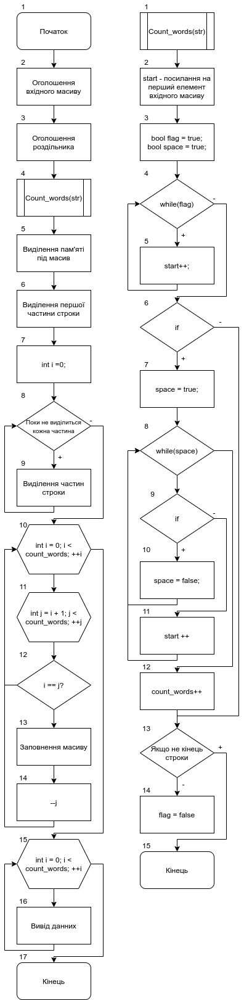
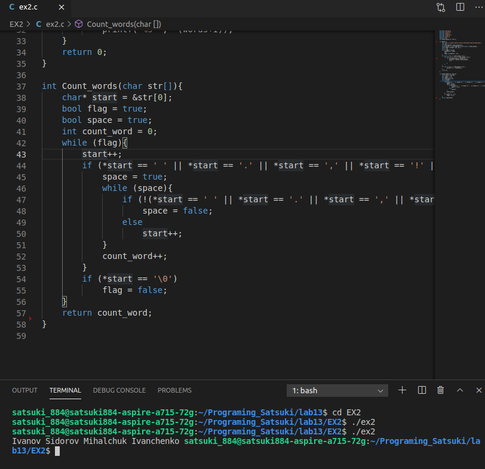

# Лабораторна робота №13. Строки
## Вимоги:
-   Розробник: Клименко Станіслава
-   Загальне завдання: Реалізувати програму з використанням строк.
- Індивідуальне завдання: Реалізувати програму, що видаляє з данного тексту прізвища, що повторюються.

 ## Опис програми :

 - *Функціональне призначення*:  Створення нового, вихідного, масиву, що складається з прізвищ, що не будеть повторюватися.

 - *Опис логічної структури*:
    - Функція``main`` приймає в себе вхідний масив(блок 2), строку, у якій записані прізвища. Також має у собі масив "роздільник"(блок 3), для подальшого разділення строки на елементі за допомогою функції strtok(блок 6) і подальшого while для знаходження всіх таких елементів(блок 8, 9), сигментів у масиві. Оголошуємо двухвимірний масив і одразу виділяємо йому пам'ять(блок 5), після того, як знайдемо кількість прізвищ у вхідному масиві за допомогою функції ``Count_words``, що викликаємо до оголошення вихідного масиву(блок 4). Після того, як ми дізналися, скільки прізвищ і оголосили масив, створюємо цикл, за допомогою якого заповнюємо наш вихідний масив(блок 10,11).
    ДЛя цього у циклі виконуємо перевірку на те, чи не дорівнює у нас одне прізвище іншому(блок 12), якщо умова виконується, то значення, то на місце елементу, що повторюється записується останній елемент, а якщо елемент і так останній, то цикл закінчується(блок 13, 14).
    Щоб дізнаватися щодо того, як виконюється і чи правильно протікає робота, використовую новий цикл і функцію printf, виводячи кожен елемент(блок 15, 16).
    - Функція ``Count_words``рахує скільки у нашому масиві прізвищ(блок 12). За одне прізвище вираховується елемент між якимось розділовими знаками, будь то точка, кома, чи пропуск(блок 4-11).

 - Блок-схема алгоритму функції:

     

Рисунок 1 — блок-схема програми
- Важливі елементи програми.
    * Знаходження кількості прізвищ за допомогою функцїї ``Count_words``.
    * Поділення масииву на "відрізки".
    * Заповнення вихідного масиву.

## Варіанти використання программи 1
- Поставимо точку зупину наприкінці нашої функції, та побачимо значення вхідного та вихідного масивів.

    

## Висновок:
Для виконання лабораторної роботи ми навчились створювати та реалізовувати алгоритми функції, створювати схеми алгоритмів, вивчили функції strcpy, strtok та інші.
