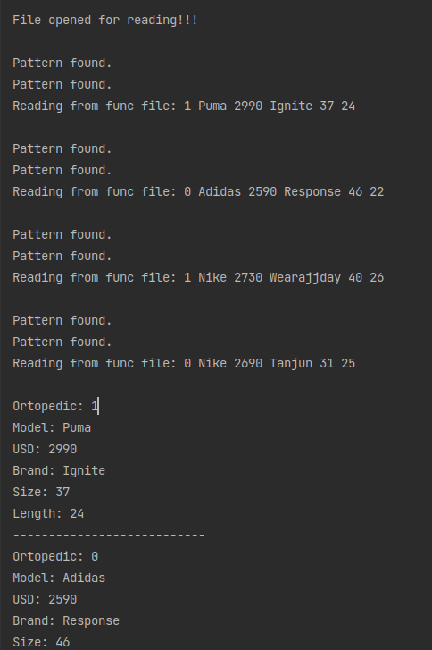

# Лабораторна робота №6. Регулярні вирази

## 1. Вимоги

### 1.1 Розробник

- Клименко Станіслава Олександрівна;

- студентка групи КІТ-120а;

- 22-квітня-2021

### 1.2 Загальне завдання

1. При введені інформації про базовий тип виконати перевірку:
    * Можна вводити тільки кириличні символи, латинські символи, цифри, пропуски, розділові знаки

    * Не повинно бути пропусків та розділових знаків, які повторюються
    * Перше слово не повинно починатися з маленького символу

2. У клас-список додати метод, що виводить на екран список усіх об'єктів, які мають одне або більше полів з щонайменше двома словами (перевірку виконати за допомогою регулярних виразів)

### 1.3 Індивідуальне завдання

Виконати завдання згідно варіанту


## 2. Опис програми

### 2.1 Функціональне призначення

За допомогою регулярних виразів виконується перевірка вхідного тексту

### 2.2 Опис логічної структури програми

Загальне завдання виконується за допомогою розроблених функцій. Функції:  `reg_func`, `reg`, `reg2` виконують перевірку вхідного тексту;
_Головна функція_`main()`. Виконує взаємодію з користувачем шляхом діалогового меню. Викликає функції `reg_func`, `reg`, `reg2` в залежності від запитів користувача
_Схема алгоритму функції_ подана на рис. 1.


Рисунок 1  --- Схема алгоритму функції `main`


_Функція перевірки_ `reg_func`. виконує перевірку вхідного тексту за допомогою регулярних виразів, та в залежності від перевірки додає новий елемент в список .
_Схема алгоритму функції_ подана на рис. 2.


Рисунок 2 --- Схема алгоритму функції `reg_func`


### 2.3 Важливі фрагменти програми

#### Перевірка вхідного тексту за допомогою регулярних виразів

``` 
int reg_func(char * string1){
    regex_t regex;
    char *reg = "^[А-ЯЁA-Z0-9][-a-zA-Z0-9а-яёА-ЯЁ.,;!?: ]*$";
    int return_value = regcomp(&regex,reg,0);
    return_value = regexec(&regex, string1, 0, NULL, 0);
    return return_value;
}
int reg(char * string){
    regex_t regex;
    char *reg = "^([а-яёА-ЯЁa-wA-Z0-9]+([^а-яёА-ЯЁa-zA-Z0-9]+|$)){2,}$";
    int return_value = regcomp(&regex,reg,REG_EXTENDED);
    return_value = regexec(&regex, string, 0, NULL, 0);
    return return_value;
}
int reg2(char * string){
    regex_t regex;
    char *reg = "(\\.\\.|  |,,|;;|::|!!|\\?\\?|--)";
    int return_value = regcomp(&regex,reg,REG_EXTENDED);
    return_value = regexec(&regex, string, 0, NULL, 0);
    return return_value;
}
  
```


### 3. Варіанти використання



Рисунок 3 --- Результат виконання програми

## Висновки

Ми навчились працювати з регулярними виразами

