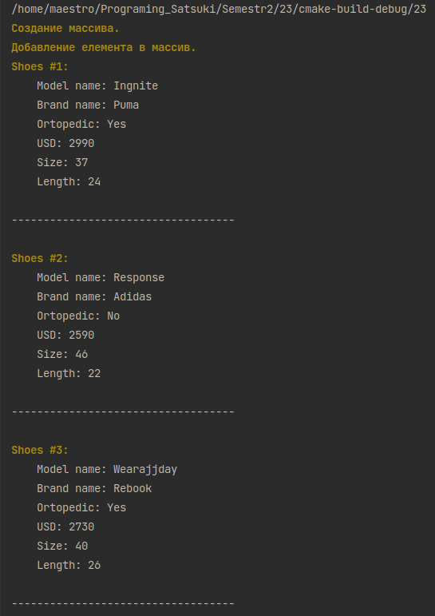

# Лабораторна робота №7. Вступ до ООП

## 1. Вимоги

### 1.1 Розробник

- Клименко Станіслава Олександрівна;

- студентка групи КІТ-120а;

- 29-квітня-2021

### 1.2 Загальне завдання

1. **Розробити клас**, що відображає сутність базового класу, у тому числі:
    * конструктор за замовчуванням
    * конструктор копіювання
    * конструктор з аргументами
    * деструктор

2. **Розробити клас**, що  має у собі:
    * динамічний масив об'єктів базового класу
    * метод додавання елемента
    * метод видалення елемента
    * метод отримання елемента по індексу
    * метод виводу усіх елементів на екран
    * метод 1 обходу колекції (знаходження німецького міського рюкзака)

### 1.3 Індивідуальне завдання

Виконати завдання згідно варіанту


## 2. Опис програми

### 2.1 Функціональне призначення

Загальне завдання виконується за допомогою розроблених методів.

### 2.2 Опис логічної структури програми

Загальне завдання виконується за допомогою розроблених методів. Методи:  `add_object` додає нові елементи в список;`delete_element` видаляє елемент зі списку по індексу; `Get_object` отримує елемент по індексу; `Show_array` виводить список на екран.

_Головна функція_`main()`.
Створює елементи списку та додає їх у список, викликає усі розроблені методи


Рисунок 1 --- Схема алгоритму методу `delete_element`


### 2.3 Важливі фрагменти програми

#### Метод виводу не екран

```
 void show_array(){
        for(int i =0; i<Size_array; i++){
            //\33[1:33m[INFO]\33[0m
            cout << "\33[1:33mShoes #" << i+1 << ":\33[0m";
            cout<< "\n\tModel name: "<<this->Shoes[i].GetModelName()<<endl;
            cout<< "\tBrand name: ";
            if (this->Shoes[i].GetBrand() == ShoesBase::Brand::nike)
                cout << "Nike"<<endl;
            else if (this->Shoes[i].GetBrand() == ShoesBase::Brand::rebook)
                cout << "Rebook"<<endl;
            else if (this->Shoes[i].GetBrand() == ShoesBase::Brand::adidas)
                cout << "Adidas"<<endl;
            else if (this->Shoes[i].GetBrand() == ShoesBase::Brand::puma)
                cout << "Puma"<<endl;
            else cout << "No brand"<<endl;
            cout<< "\tOrtopedic: "<<(this->Shoes[i].GetIsOrtopedic() ? "Yes" : "No" )<<endl;
            cout<< "\tUSD: "<<this->Shoes[i].GetPriceUSD()<<endl;
            cout<< "\tSize: "<<this->Shoes[i].GetInsoleSize()<<endl;
            cout<< "\tLength: "<<this->Shoes[i].GetInsoleLength()<<endl;
            cout<< "\n-----------------------------------\n\n";
        }
    }
```
#### Метод видалення  елементу
```
void delete_element(int index){
        if(index <0) index =0;
        else if(index>=Size_array) index = Size_array-1;
        ShoesBase *Shoes_new = new ShoesBase[Size_array-1];
        for(int i =0; i <index; i++ ){
            Shoes_new[i]= Shoes[i];
        }
        for(int i =index+1; i <Size_array; i++ ){
            Shoes_new[i-1]= Shoes[i];
        }
        Shoes = Shoes_new;
        Size_array--;
        show_array();
    }
```
#### Метод отримання елементу по індексу
```
ShoesBase Get_object(int index){
        return Shoes[index];
    }~~~~
```
#### Метод додання елементу
```
void add_object(ShoesBase & new_element){
        int a= -1;
        for(int i=0; i <Size_array; i++){
            if(this->Shoes[i].GetPriceUSD() == 0) {
                a=i;
                break;
            }
        }
        if(a < 0){
            ShoesBase *Shoes_new = new ShoesBase[Size_array+1];
            for(int i=0; i< Size_array; i++){
                Shoes_new[i]= Shoes[i];
            }
            Shoes = Shoes_new;
            a = Size_array;
            Size_array++;
        }
        Shoes[a] = new_element;
        show_array();
    }
```
### 3. Варіанти використання


Рисунок 2 --- Результат виконання програми


Рисунок 3 --- Результат виконання програми


Рисунок 4 --- Результат виконання програми

## Висновки

Ми навчились створювати класи, та розробляти методи для роботи з ними.

