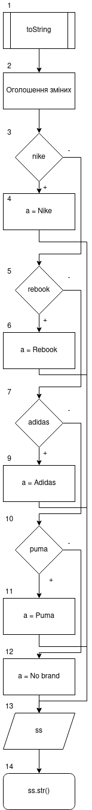

# Лабораторна робота №8. ООП. Потоки

## 1. Вимоги

### 1.1 Розробник

- Клименко Станіслава Олександрівна;

- студентка групи КІТ-120а;

- 30-квітня-2021

### 1.2 Загальне завдання

* **Поширити**, попередню роботу таким чином:
    * використання функцій `printf/scanf` замінити на `cin/cout`;
    * усі конкатенації строк замінити на використання `stringstream`;
    * замінити метод вводу інформації про об'єкт на метод, що приймає рядок з інформацією про об'єкт, обробляє його та створює об'єкт  на базі цієї інформації;
    * поширити клас-список, шляхом реалізації методів роботи з файлами.


### 1.3 Індивідуальне завдання

Виконати завдання згідно варіанту


## 2. Опис програми

### 2.1 Функціональне призначення

Загальне завдання виконується за допомогою розроблених методів.

### 2.2 Опис логічної структури програми

Загальне завдання виконується за допомогою розроблених методів. Методи:  `toString()` перетворює об'єкт в строку; `ReadFromFile` зчитує масив елементів з файлу; `WriteToFile` записує масив елементів у файл .

_Головна функція_`main()`.
Створює елементи списку та додає їх у список, викликає усі розроблені методи



Рисунок 1 --- Схема алгоритму методу `toString()`

_Метод_ `ReadFromFile`: Метод зчитує масив елементів з файлу.

_Метод_ `WriteToFile`: Метод записує масив елементів у файл.


### 2.3 Важливі фрагменти програми

#### Метод обробки рядка в об'єкт

``` 
void addObjectFromLine(std::string line){
        std::stringstream ss;
        std::string ortopedic;
        std::string model_name;
        std::string brand_name;
        ShoesBase::Brand brand;
        std::string usd;
        std::string size;
        std::string length;
            ss<<line;
            getline(ss, model_name, ' ');
            getline(ss, brand_name, ' ');
            if (brand_name =="Nike")
                brand = ShoesBase::Brand::nike;
            else if (brand_name =="Rebook")
                brand = ShoesBase::Brand::rebook;
            else if (brand_name =="Adidas")
                brand = ShoesBase::Brand::adidas;
            else if (brand_name =="Puma")
                brand = ShoesBase::Brand::puma;
            else brand = ShoesBase::Brand::no_brand;
            getline(ss, ortopedic, ' ');
            getline(ss, usd, ' ');
            getline(ss, size, ' ');
            getline(ss, length, ' ');
            ss.clear();
            ShoesBase *new_element = new ShoesBase(ortopedic=="Yes", model_name, std::stoi(usd), ShoesBase::insole{std::stoi(size), std::stoi(length)}, brand);
        add_object(*new_element);
       // }
    }
  
```
#### Метод перетворення об'єкта в строку

```
string toString(int index){
        std::stringstream ss;
        std::string a ;
        if (Shoes[index].GetBrand() == ShoesBase::Brand::nike)
            a = "Nike";
        else if (Shoes[index].GetBrand() == ShoesBase::Brand::rebook)
            a = "Rebook";
        else if (Shoes[index].GetBrand() == ShoesBase::Brand::adidas)
            a = "Adidas";
        else if (Shoes[index].GetBrand() == ShoesBase::Brand::puma)
            a = "Puma";
        else a = "No brand";
        ss<< "\tModel: " << Shoes[index].GetModelName() << "\n\tBrand: " << a << "\n\tOrtopedic: " << (Shoes[index].GetIsOrtopedic() ? "Yes" : "No") <<"\n\tUSD: " << std::to_string(Shoes[index].GetPriceUSD()) << "\n\tSize: " << std::to_string(Shoes[index].GetInsoleSize()) << "\n\tLength: " << std::to_string(Shoes[index].GetInsoleLength()) ;
        return ss.str();
    }
```
#### Метод зчитування елементів з файлу
```
oid ReadFromFile() {
        std::ifstream file("Saerch.txt");
        std::string line;
        int i =0;
        if (file.is_open()) {
            cout<<"File opened for reading!!!"<< endl;
            while (getline(file, line)) {
                if(!line.empty()){
//                    cout<<"Записываем строку в Shoes["<<i<<"]"<<endl;
                    addObjectFromLine(line);
                }
                i++;
            }
        }
        file.close();
    }
```
#### Метод запису масиву елементів у файл
```
void SaveInFile(std::ofstream &file){
        for(int i = 0; i< Size_array; i++){
            file << toString(i) << endl;
        }
    }
```

### 3. Варіанти використання


Рисунок 4 --- Результат виконання програми


## Висновки

Ми навчились працювати з потоками.

