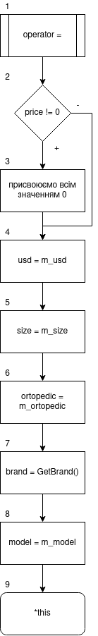
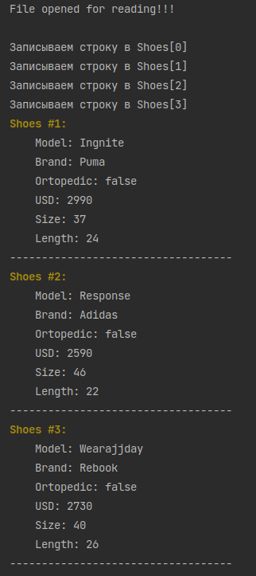

# Лабораторна робота №9. Перевантаження операторів

## 1. Вимоги

### 1.1 Розробник

- Клименко Станіслави Олександрівни;

- студентки групи КІТ-120а;

- 5 травня-2021

### 1.2 Загальне завдання

* **Поширити**, попередню роботу таким чином:
1. **У базовому класі**, та класі/класах-спадкоємцях перевантажити:
    * оператор присвоювання;
    * оператор порівняння ( ``==`` ) ;
    * оператор введення/виведення;
2. **У класі-списку** перевантажити:
    * оператор індексування ( ``[]`` ) ;
    * введення/виведення з акцентом роботи, у тому числі і з файлами.
* При цьому продовжувати використовувати регулярні вирази для валідації введених даних.


### 1.3 Індивідуальне завдання

Виконати завдання згідно варіанту


## 2. Опис програми

### 2.1 Функціональне призначення

Загальне завдання виконується за допомогою розроблених перевантажень операторів

### 2.2 Опис логічної структури програми

_Перевантаження:_  `ShoesBase & operator = (const ShoesBase& other)`  
перевантажує оператор присвоювання (``=``) для классу ``ShoesBase``.
_Схема алгоритму перевантаження оператора_ подана на рис. 1.


Рисунок 1 --- Схема алгоритму перегрузки оператора `=`

_Перевантаження:_ `bool operator == (const ShoesBase& other)`. перевантажує оператор порівняння (``==``).

_Перевантаження:_  `friend std::ostream & operator << (std::ostream& os, const ShoesBase& Shoes)` перевантажує оператор виводу (``<<``).

_Перевантаження:_  `friend std::istream & operator >> (std::istream& is, ShoesBase& Shoes)`перевантажує оператор вводу (``>>``).

_Перевантаження:_  `ShoesBase & operator [](const int index)`перевантажує оператор індексування (``[]``).


### 2.3 Важливі фрагменти програми

#### Перевантаження оператора порівняння

``` 
bool operator == (const ShoesBase& other){
        bool result =true;
        if(this->m_price_usd != other.m_price_usd){
            result = false;
        } else if(this->m_insole_size.size != other.m_insole_size.size){
            result = false;
        }else if(this->m_insole_size.length != other.m_insole_size.length){
            result = false;
        }else if(this->m_is_ortopedic != other.m_is_ortopedic){
            result = false;
        }else if(this->m_brand != other.GetBrand()){
            result = false;
        }else if(this->m_model_name == other.m_model_name){
            result = false;
        }
        return result;
    }
  
```
#### Перевантаження оператора присвоювання

```
ShoesBase & operator = (const ShoesBase& other)
    {//        cout<<"Вызвался оператор присваивания "<<this;//endl;
        if(this->m_price_usd!=0){
            this->m_price_usd=0;
            this->m_is_ortopedic=0;
            this->m_insole_size.length=0;
            this->m_insole_size.size=0;
        }
        this->m_price_usd = other.m_price_usd;
        this->m_insole_size = other.m_insole_size;
        this->m_is_ortopedic = other.m_is_ortopedic;
        this->m_brand = other.GetBrand();
        this->m_model_name = other.m_model_name;
        return *this;
    }
```
#### Перевантаження оператора виводу для базового класу
```
friend std::ostream & operator << (std::ostream& os, const ShoesBase& Shoes){
        std::string a ;
        if (Shoes.GetBrand() == ShoesBase::Brand::nike)
            a = "Nike";
        else if (Shoes.GetBrand() == ShoesBase::Brand::rebook)
            a = "Rebook";
        else if (Shoes.GetBrand() == ShoesBase::Brand::adidas)
            a = "Adidas";
        else if (Shoes.GetBrand() == ShoesBase::Brand::puma)
            a = "Puma";
        else a = "No brand";
        os<<"\tModel: " << Shoes.GetModelName() << endl<<"\tBrand: " << a << "\n\tOrtopedic: " << (Shoes.GetIsOrtopedic() ? "true" : "false") <<"\n\tUSD: " << std::to_string(Shoes.GetPriceUSD()) << "\n\tSize: " << std::to_string(Shoes.GetInsoleSize()) << "\n\tLength: " << std::to_string(Shoes.GetInsoleLength()) << "\n-----------------------------------\n";
        return os;
    }
```
#### Перевантаження оператора вводу для базового класу
```
friend std::istream & operator >> (std::istream& is, ShoesBase& Shoes){
        std::string brand_name;
        ShoesBase::Brand brand;
        std::string ortopedic;
        std::string model_name;
        std::string usd;
        std::string size;
        std::string length;
        is >> model_name >> brand_name >>  ortopedic >> usd  >>size >> length;
        if (brand_name =="Nike")
            Shoes.m_brand = ShoesBase::Brand::nike;
        else if (brand_name =="Rebook")
            Shoes.m_brand = ShoesBase::Brand::rebook;
        else if (brand_name =="Adidas")
            Shoes.m_brand = ShoesBase::Brand::adidas;
        else if (brand_name =="Puma")
            Shoes.m_brand = ShoesBase::Brand::puma;
        else Shoes.m_brand = ShoesBase::Brand::no_brand;
        Shoes.m_price_usd =std::stoi(usd);
        Shoes.m_insole_size.size =std::stoi(size);
        Shoes.m_insole_size.length =std::stoi(length);
        Shoes.m_model_name = model_name;
        Shoes.m_is_ortopedic = ortopedic == "Yes";
        return is;
    }
```
#### Перевантаження оператора індексування для класа-списка
```
ShoesBase & operator [](const int index){
        return Shoes[index];
    }
```

### 3. Варіанти використання


Рисунок 4 --- Результат виконання програми


## Висновки

Ми навчились перевантажувати оператори для роботи з классами.

