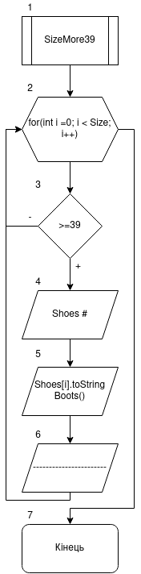
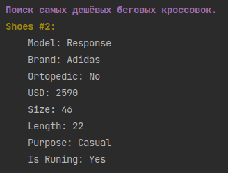
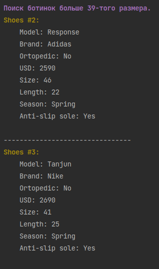

# Лабораторна робота №10. Спадкування

## 1. Вимоги

### 1.1 Розробник

- Клименко Станіслава Олександрівна;

- студентки групи КІТ-120а;

- 05-травня-2021

### 1.2 Загальне завдання

* **Поширити**, попередню роботу таким чином:
    1. **Додати** класи-спадкоємці, котрі будуть поширювати функціонал базового класу відповідно до індивідуального завдання;

    2. **Додати** клас-список для кожного класу-спадкоємця, який буде керувати лише елементами стосовно класа-спадкоємця.


### 1.3 Індивідуальне завдання

Виконати завдання згідно варіанту


## 2. Опис програми

### 2.1 Функціональне призначення

Загальне завдання виконується за допомогою розроблених методів

### 2.2 Опис логічної структури програми
Загальне завдання виконується за допомогою наступних методів:
`SizeMore39`,  `CheapRunningShoes`.

_Метод:_  `SizeMore39`: Виконує завдання 1 з "методи для роботи з колекцією"; За допомогою даного методу в класі-списку для спадкоємця 2 знаходимо чоботи розміром більш за 39.
_Схема алгоритму метода `SizeMore39`_ подана на рис. 1.


Рисунок 1 --- Схема алгоритму метода`SizeMore39`

_Метод_ `CheapRunningShoes` Виконує завдання 2 з "методи для роботи з колекцією"; За допомогою даного методу в класі-списку для спадкоємця 1 знаходимо найдешевші бігові кросівки.


### 2.3 Важливі фрагменти програми

#### Метод пошуку найдешевших бігових кросівок

``` 
void CheapRunningShoes() {
        int min_usd =-1;
        int index =-1;
        for (int i = 0; i < Size_array; i++){
            if(Shoes[index].GetIsRunning() && (min_usd < 0 || Shoes[i].GetPriceUSD()< min_usd)) {
                index = i;
                min_usd = Shoes[i].GetPriceUSD();
            }
        }
        if(index >= 0){
            cout << "\33[1:33mShoes #"<<index+1<<": \33[0m" << endl;
            cout << Shoes[index].toStringSneakers() << endl;
        } else cout << "\33[1:31mКроссовки не найдены.\33[0m" << endl;
    }
  
```
#### Метод пошуку чобіт розміром більш за 39

```
void SizeMore39(){
        for(int i =0; i < Size_array; i++) {
            if ( Shoes[i].GetInsoleSize() >=39 ) {
                //new_array[k] = Shoes[i];
                cout << "\33[1:33mShoes #" << i+1 << ":\33[0m"<<endl;
                cout<<Shoes[i].toStringBoots()<<endl;
                cout<<"--------------------------------"<<endl;
            }
        }
    }
```


### 3. Варіанти використання


Рисунок 2 --- Результат виконання пошуку найдешевших бігових кросівок


Рисунок 3 --- Результат виконання пошуку чобіт розміром більш за 39


## Висновки

Ми навчились працювати з класами-спадкоємцями та списками для них

