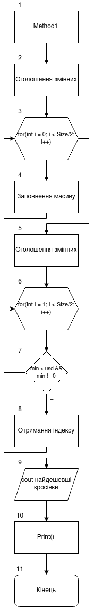
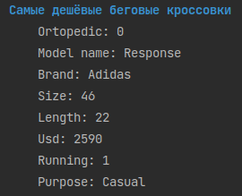
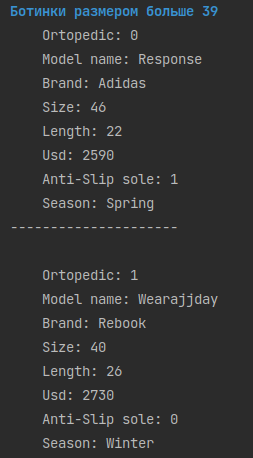
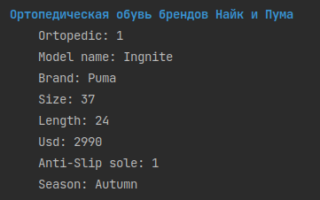


# Лабораторна робота №11. Поліморфізм

## 1. Вимоги

### 1.1 Розробник
 
- Клименко Станіслава Олександрівна;

- студентки групи КІТ-120а;

- 18-травня-2021

### 1.2 Загальне завдання

 * **Поширити**, попередню роботу таким чином:
	 1. **Зробити** базовий клас абстрактним, додати абстрактні методи;

	2. **Розроблені** класи-списки поєднуються до одного класу списку таким чином, щоб він міг працювати як з базовим класом, так і з класами-спадкоємцями;
	
	4.  **Обов'язково** використовувати ключові слова ``override`` або ``final``.

 
### 1.3 Індивідуальне завдання

Реалізувати методи 1-3 із розрахункового завдання:
1. **Знайти** найдешевші бігові кросівки;
2. **Знайти** чоботи розміром більший за 39;
3. **Знайти** ортопедичне взуття брендів Найк і Пума.

## 2. Опис програми 

### 2.1 Функціональне призначення

Загальне завдання виконується за допомогою розроблених методів

### 2.2 Опис логічної структури програми
Індивідуальне  завдання виконується за допомогою наступних методів:
`Method1`,  `Method2`,  `Method3`.

_Метод:_  `Method1`: Виконує завдання 1 з "методи для роботи з колекцією"; За допомогою даного методу в класі-списку  знаходимо найдешевші бігові кросівки.
_Схема алгоритму метода `Method1`_ подана на рис. 1.



Рисунок 1 --- Схема алгоритму метода`Method1`

_Метод_ `Method2` Виконує завдання 2 з "методи для роботи з колекцією"; За допомогою даного методу в класі-списку знаходимо чоботи розміром більший за 39;

_Метод_   `Method3`Виконує завдання 3 з "методи для роботи з колекцією"; За допомогою даного методу в класі-списку знаходимо ортопедичне взуття брендів Найк і Пума.


### 2.3 Важливі фрагменти програми

#### Метод пошуку найдешевших бігових кросівок

``` 
void List::Method1(){
    int array_of_usd[ARRAY_SIZE/2];
    for(int i =0; i < ARRAY_SIZE/2; i++) {
        array_of_usd[i] = shoes[i]->CheapRunningShoes();
    }
    int min =array_of_usd[0];
    int a = -1;
    for(int i =1; i < ARRAY_SIZE/2; i++) {
        if(min > array_of_usd[i] && min != 0 && array_of_usd[i] != 0) {
            min = array_of_usd[i];
            a = i;
        }
    }
    cout << "\33[1:34mСамые дешёвые беговые кроссовки\33[0m";
    shoes[a]->Print();
}
```
```
int Sneakers::CheapRunningShoes(){
        if(m_is_running) {
            return m_price_usd;
        }
    return 0;
}
```
#### Метод пошуку чоботів розміром більший за 39

```
void List::Method2(){
    cout << "\33[1:34mБотинки размером больше 39\33[0m";
    for(int i =ARRAY_SIZE/2; i < ARRAY_SIZE; i++) {
        shoes[i]->More39();
    }

}
```
```
void Boots::More39() {
    if(m_insole_size.getSize() >=39) {
        Print();
    }
}
```
#### Метод пошуку ортопедичного взуття брендів Найк і Пума

```
void List::Method3(){
    cout << "\33[1:34mОртопедическая обувь брендов Найк и Пума\33[0m";
    for(int i =0; i < ARRAY_SIZE; i++) {
        shoes[i]->NikePuma();
    }
}
```
```
void Boots::NikePuma(){
    if(m_is_ortopedic == 1 && ( m_brand == Brand::nike || m_brand ==Brand::puma)){
        Print();
    }
}
```


### 3. Варіанти використання



Рисунок 2 --- Результат виконання пошуку найдешевших бігових кросівок



Рисунок 3 --- Результат виконання пошуку чоботів розміром більший за 39



Рисунок 4 --- Результат виконання пошуку ортопедичного взуття брендів Найк і Пума


## Висновки

Ми зрозуміли що таке "Поліморфізм"; навчились працювати з класами-спадкоємцями та зі списком для них.

