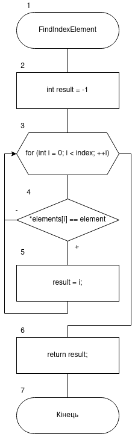
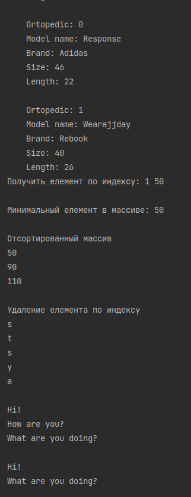


# Лабораторна робота №13. Шаблонні функції та класи

## 1. Вимоги

### 1.1 Розробник
 
- Клименко Станіслава Олександрівна;

- студентка групи КІТ-120а;

- 28-травня-2021

### 1.2 Загальне завдання

 * **Створити**, шаблонний клас та наступні методи:
	* Вивод вміслу масиву на екран;
	* Визначення індексу переданого елемента в заданому масиві;
	* Відсортувати елементи масиву;
	* Визначити значення мінімального елементу масиву;
	* Додати елемент до кінця масиву;
	* Видалити елемент з масиву за індексом. 

 
### 1.3 Індивідуальне завдання

Виконати завдання згідно варіанту

## 2. Опис програми 

### 2.1 Функціональне призначення

Загальне завдання виконується за допомогою розроблених шаблонних методів

### 2.2 Опис логічної структури програми
Загальне завдання виконується за допомогою розроблених шаблонних методів:
`addElement`,  `getElement`,  `deleteElement`. `FindMinElement`, `FindIndexElement`, `SortList`, `ShowList`.

_Метод:_  `FindIndexElement`: Знаходить в списку індекс заданого елементу.
_Схема алгоритму метода `FindIndexElement`_ подана на рис. 1.


Рисунок 1 --- Схема алгоритму метода`FindIndexElement`

_Метод_ `addElement` Додає новий елемент в кінець списку.

_Метод_   ``getElement`` Повертає елемент зі списку за заданим індексом

_Метод_   `deleteElement`.  Видаляє елемент із списку за індексом

_Метод_   `FindMinElement`,  Повертає значення мінімального елемента

_Метод_  `FindIndexElement`, Повертає індекс заданого елемента

_Метод_   `SortList`,   Сортує список від меншого до більшого

_Метод_   `ShowList` Виводить вміст списку на екран


### 2.3 Важливі фрагменти програми

#### Метод пошуку індексу заданого елемента

``` 
int FindIndexElement(Type &element){  
    int result = -1;  
    for (int i = 0; i < index; ++i) {  
	    if (*elements[i] == element){  
		    result = i;  
        }  
    }  
  return result;  
};
```
#### Метод видалення елементу зі списку за індексом

```
void deleteElement(int index){  
  if (index < 0) {  
  index = 0;  
    }  
  if (index >= this->index) {  
  index = this->index - 1;  
    }  
  for (int i = index; i < this->index; ++i) {  
  elements[i] = elements[i+1];  
    }  
  this->index--;  
}
```


### 3. Варіанти використання



Рисунок 4 --- Результат виконання кроку 3


## Висновки

Ми навчились працювати з шаблонними класами, методами та  функціями

