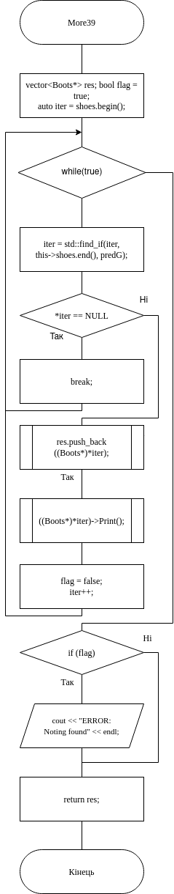
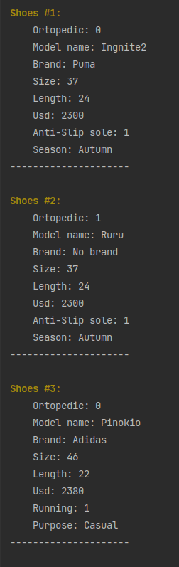
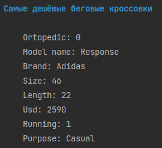
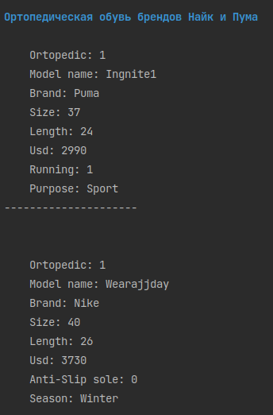
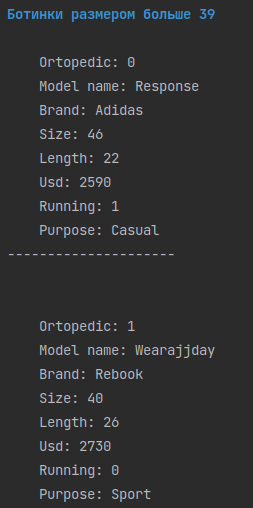
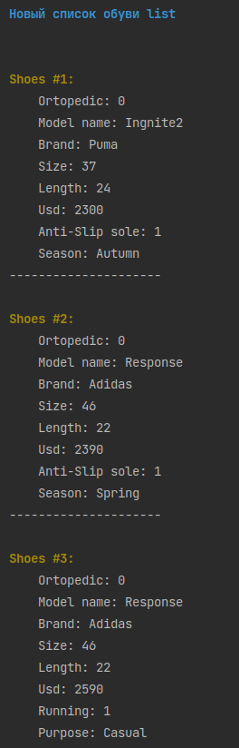
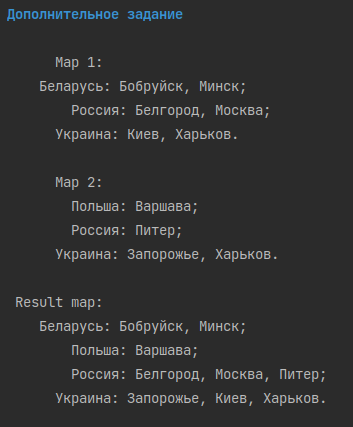


# Лабораторна робота №14. STL. Вступ до Стандартної бібліотеки шаблонів(частина 1)

## 1. Вимоги

### 1.1 Розробник
 
- Клименко Станіслава Олесандрівна;

- студентка групи КІТ-120а;

- 2-червня-2021

### 1.2 Загальне завдання

 * **Поширити**, лабораторну роботу №27 таким чином:
	 1. **Замінити** масив та CRUD методи роботи з ним на використання STL;

	2. **Оновити** всі методи роботи з колекцією на використання STL;
	
	3.  **Додати** функцію сортування колекції з використанням функтора.
	4.  **Додати** функцію об'єднання двох класів-списків.
* Додати можливість об'єднання двох STL-контейнерів типу map.

 
### 1.3 Індивідуальне завдання

Виконати завдання, згідно варіанту

## 2. Опис програми 

### 2.1 Функціональне призначення

Загальне завдання виконується за допомогою розроблених методів

### 2.2 Опис логічної структури програми
Індивідуальне  завдання виконується за допомогою наступних методів:
`More39`,  `NikePuma`,  `CheapRunningShoes`.

_Метод:_  `More39`: Виконує завдання 1 з "методи для роботи з колекцією"; За допомогою даного методу в класі-списку  знаходимо чоботи розміром більш за 39.
_Схема алгоритму метода `More39`_ подана на рис. 1.



Рисунок 1 --- Схема алгоритму метода`More39`

_Метод_ `SortByPrice` Виконує сортування за допомогою STL-функції `sort` та розробленого функтора `functor`.

_Метод_ `InsertList` Виконує об'єднання двох класів-списків за допомогою STL-функції `Insert`.

_Метод_ `ExcellentTask` Виконує об'єднання двох STL-контейнерів тип map.

_Метод_ `CheapRunningShoes` Виконує завдання 2 з "методи для роботи з колекцією"; За допомогою STL-функції `find_if` предиката `PredS` в класі-списку знаходимо найдешевші бігові кросівки;

_Метод_   `NikePuma`Виконує завдання 3 з "методи для роботи з колекцією"; За допомогою STL-функції `find_if` предиката `PredМ` в класі-списку знаходимо ортопедичне взуття брендів Найк і Пума.


### 2.3 Важливі фрагменти програми

#### Метод пошуку найдешевших бігових кросівок

``` 
vector<Sneakers*>  List::CheapRunningShoes(){
    vector<Sneakers*> res;
    bool flag = true;
    auto iter = shoes.begin();
    //while (*iter) {
        iter = std::find_if(iter, this->shoes.end(), predS);
        if(*iter == NULL){
            cout << "ERROR: Nothing found" << endl;
        }
        flag = false;
        ((Sneakers*)*iter)->Print();
        cout << endl;
        res.push_back((Sneakers*)*iter);
        iter++;
    //}
    if (flag){
        cout << "ERROR: Nothing found" << endl;
    }
    return res;
}
```
#### Метод пошуку чоботів розміром більший за 39

```
vector<Boots*> List::More39() {
    vector<Boots*> res;
    bool flag = true;
    auto iter = shoes.begin();
    while (true) {
        iter = std::find_if(iter, this->shoes.end(), predG);
        if(*iter == NULL){
            break;
        }
        flag = false;
        res.push_back((Boots*)*iter);
        ((Boots*)*iter)->Print();
        cout << endl;
        iter++;
    }
    if (flag){
        cout << "ERROR: Nothing found" << endl;
    }
    return res;
}
```
#### Метод пошуку ортопедичного взуття брендів Найк і Пума

```
vector<Shoes*>  List::NikePuma() {
    vector<Shoes*> temp;
    auto iter = shoes.begin();
    auto iter2 = shoes.begin();
    bool flag = true;
    while (*iter) {
        iter = std::find_if(iter, this->shoes.end(), predM);
        if(*iter == NULL){
            break;
        }
        flag = false;
        ((Sneakers*)*iter)->Print();
        cout << endl;
        temp.push_back((Sneakers*)*iter);
        iter++;
    }
    if (flag){
        cout << "ERROR: Nothing found" << endl;
    }
    return temp;
}
```
#### Метод об'єднання двох класів-списків
```
void List::InsertList(List &in) {
    this->shoes.reserve(this->index + in.index);
    auto iter = this->shoes.end();
    for (int i = 0; i < in.index; ++i) {
        this->shoes.insert(iter + i, in.shoes[i]);
    }
    this->index += in.index;

}
```

### 3. Варіанти використання

Для демонстрації результатів використовується Clion. Нижче наводиться послідовність  дій запуску програми.

_Крок 1_ (рис.2 ). Демонстрація роботи методу сортування




Рисунок 2 --- Результат виконання кроку 1

_Крок 2_ (рис.3 ). Демонстрація  роботи методів пошуку



Рисунок 3 --- Результат виконання кроку 2



Рисунок 4 --- Результат виконання кроку 2



Рисунок 5 --- Результат виконання кроку 2

_Крок 3_ (див. рис.4 ). Результат виконання методу об'єднання двох класів-списків



Рисунок 6 --- Результат виконання кроку 3

_Крок 4_ (див. рис.5 ). Демонстрація  об'єднання двох STL-контейнерів тип map



Рисунок 7 --- Результат виконання кроку 4


## Висновки

Ми навчилися працювати зі стандартною бібліотекою шаблонів, з STL-контейнерами  та їх методами і функціями.

