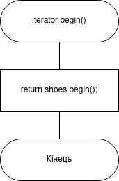
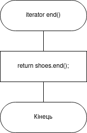
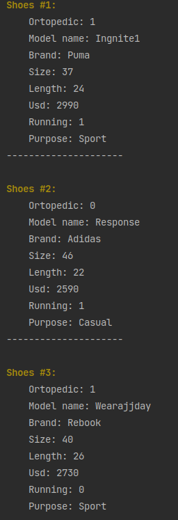


# Лабораторна робота №15. STL. Вступ до Стандартної бібліотеки шаблонів(частина 2)

## 1. Вимоги

### 1.1 Розробник
 
- Клименко Станіслава Олександрівна;

- студентка групи КІТ-120а;

- 3-червня-2021

### 1.2 Загальне завдання

 * **Розширити** попередню роботу, зробивши клас-список STL ітеративним. 

## 2. Опис програми 

### 2.1 Функціональне призначення

Загальне завдання виконується за допомогою розроблених методів
`begin()` та `end()`.

### 2.2 Опис логічної структури програми

_Метод:_  `begin()`: повертає початок вектора класа-контейнер
_Схема алгоритму метода `begin()`_ подана на рис. 1.


Рисунок 1 --- Схема алгоритму метода`begin()`


_Метод:_  `end()`: повертає кінець вектора класа-контейнер
_Схема алгоритму метода `end()`_ подана на рис. 2.


Рисунок 2 --- Схема алгоритму метода`end()`


### 2.3 Важливі фрагменти програми

#### Метод `begin()`

``` 
iterator begin(){  
    return shoes.begin();  
}
```
#### Метод `end()`

```
iterator end(){  
	return shoes.end();  
}
```
#### Демонстрація ітеративності
```
List<Shoes> *list;  
for(auto &shoes : *list){  
	shoes->Print();  
	cout << endl;  
}
```

### 3. Варіанти використання

Для демонстрації результатів використовується Clion. Нижче наводиться послідовність  дій запуску програми.

_Крок 1_ (рис.3 ). Демонстрація роботи ітеративності



Рисунок 3 --- Результат виконання кроку 1


## Висновки

Ми навчилися працювати зі стандартною бібліотекою шаблонів, з STL-контейнерами, їх методами і функціями. Також навчились працювати з ітераторами та створювати власті ітеративні контейнери.

