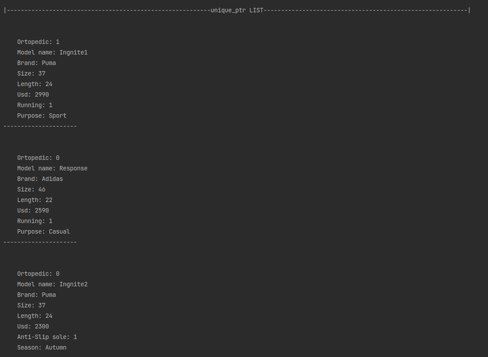
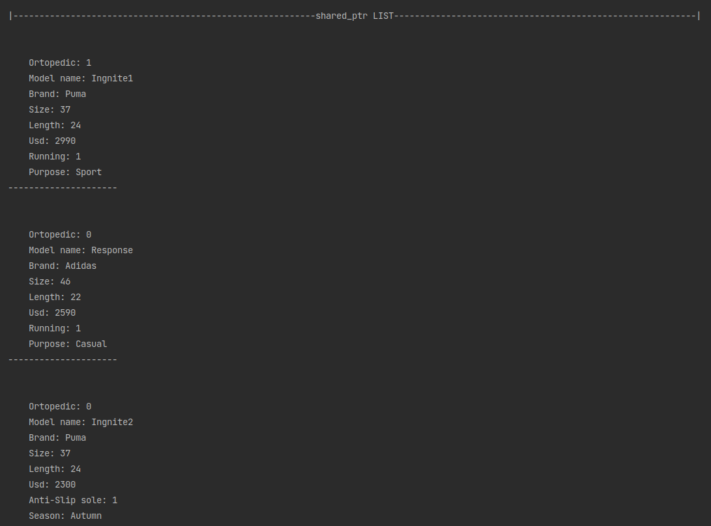
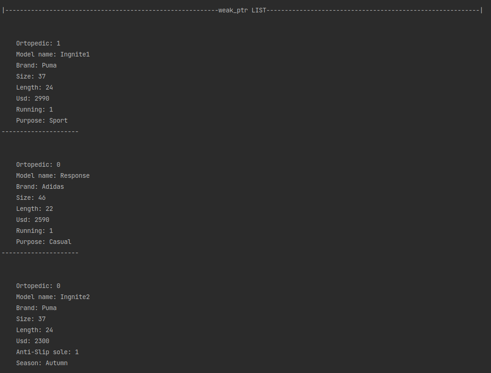


# Лабораторна робота №16. ООП. Розумні вказівники

## 1. Вимоги

### 1.1 Розробник

- Клименко Станіслава Олександрівна;

- студентка групи КІТ-120а;

- 3-червня-2021

### 1.2 Загальне завдання

 * **Створити** STL-контейнер, що містить у собі об'єкти ієрархії класів, використати розумні вказівники:
	 * `unique_ptr`
	 * `shared_ptr`
	 * `weak_ptr  `

## 2. Опис програми 

### 2.1 Функціональне призначення

Загальне завдання виконується за допомогою розумних вказівників: `unique_ptr`, `shared_ptr` та `weak_ptr`.

### 2.2 Опис логічної структури програми

_Вказівник:_  `unique_ptr`: Унікальний вказівник, який використовується для управління будь-яким динамічно виділеним об'єктом / ресурсом, але з умовою, що `unique_ptr` повністю володіє переданим йому об'єктом, а не «ділиться володінням» ще з іншими вказівниками. Таким чином, не можна  `unique_ptr` покажчику присвоїти інший  `unique_ptr` покажчик, який посилається на інший об'єкт. 


_Вказівник:_  `shared_ptr`: даний розумний покажчик  використовується для володіння одним динамічно виділеним ресурсом відразу декількома розумними покажчиками. Ресурс буде знищений, коли останній `shared_ptr` вийде з зони видимості.

_Вказівник:_  `weak_ptr`: використовується для вирішення проблеми «циклічної залежності», яку може створити`shared_ptr`.  `weak_ptr`є «спостерігачем» - він може спостерігати і отримувати доступ до того ж об'єкту, на який вказує `shared_ptr`, але не рахуватися власником цього об'єкта. І коли `shared_ptr` виходить з області видимості, він перевіряє, чи є інші власники `shared_ptr`. А **`weak_ptr`власником не рахується!**


### 2.3 Важливі фрагменти програми

####  Створення контейнеру на основі `unique_ptr`

``` 

        List<unique_ptr<Shoes>> list;

        unique_ptr<Shoes> uniquePtr(new Sneakers(sneakers));
        unique_ptr<Shoes> uniquePtr1(new Sneakers(sneakers2));
        unique_ptr<Shoes> uniquePtr3(new Boots(boots));
        unique_ptr<Shoes> uniquePtr4(new Boots(boots2));
        {
            unique_ptr<Shoes> uniquePtr6(std::move(uniquePtr)); // После выполнения uniquePtr ни на что не указывает
            cout << "Demo: " << endl;
            uniquePtr6.get()->Print();
            cout << endl << endl;
            uniquePtr = std::move(uniquePtr6);  // После выполнения uniquePtr возврщается прежнее значение, а uniquePtr6
            // больше ни на что не указывает
        }

        list.addItem(&uniquePtr);
        list.addItem(&uniquePtr1);
        list.addItem(&uniquePtr3);
        list.addItem(&uniquePtr4);

for (auto &shoes : list) {
            shoes->get()->Print();  
            cout << endl;
        }
```

####  Створення контейнеру на основі `shared_ptr`

``` 
List<shared_ptr<Shoes>> list;

        shared_ptr<Shoes> sharedPtr (new Sneakers(sneakers));
        shared_ptr<Shoes> sharedPtr1  (new Sneakers(sneakers2));
        shared_ptr<Shoes> sharedPtr3  (new Boots(boots));
        shared_ptr<Shoes> sharedPtr4  (new Boots(boots2));
        shared_ptr<Shoes> sharedPtr6  (sharedPtr);   // sharedPtr6 указывает на тот же объект, что и sharedPtr
        // и в таком случае объект будет уичтожен только тогда,
        // когда оба этих указателей выйдут за облость видимости функции


        list.addItem(&sharedPtr);
        list.addItem(&sharedPtr1);
        list.addItem(&sharedPtr3);
        list.addItem(&sharedPtr4);
        list.addItem(&sharedPtr6);

for (auto &backpack : list) {  
	  shoes->get()->Print();  // используем метод get() для конвертации std::shared_ptr в обычный указатель  
	  cout << endl;  
}
```

####  Створення контейнеру на основі `shared_ptr`

``` 
List<weak_ptr<Shoes>> list;

        weak_ptr<Shoes> weakPtr = sharedPtr;
        weak_ptr<Shoes> weakPtr1 = sharedPtr1;
        weak_ptr<Shoes> weakPtr3 = sharedPtr3;
        weak_ptr<Shoes> weakPtr4 = sharedPtr4;
        weak_ptr<Shoes> weakPtr6 = weakPtr;


        list.addItem(&weakPtr);
        list.addItem(&weakPtr1);
        list.addItem(&weakPtr3);
        list.addItem(&weakPtr4);
        list.addItem(&weakPtr6);

for (auto &backpack : list) {  
	  shoes->lock()->Print();  //используем метод lock() для конвертации std::weak_ptr в std::shared_ptr  
	  cout << endl;  
}
```

### 3. Варіанти використання

Для демонстрації результатів використовується Clion. Нижче наводиться послідовність  дій запуску програми.

_Крок 1_ (рис.1 ). Демонстрація контейнеру на основі `unique_ptr`



Рисунок 1 --- Результат виконання кроку 1

_Крок 2_ (рис.2 ). Демонстрація контейнеру на основі `shared_ptr`



Рисунок 2 --- Результат виконання кроку 2

_Крок 3_ (рис.3 ). Демонстрація контейнеру на основі `weak_ptr`



Рисунок 3 --- Результат виконання кроку 3


## Висновки

Ми навчилися працювати зі стандартною бібліотекою шаблонів, з STL-контейнерами, їх методами і функціями. Також навчились використовувати розумні вказівники та дізналися різницю між ними.

