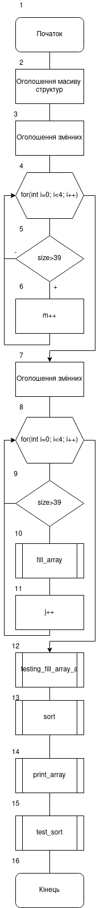

# Лабораторна робота №15-17. Структуровані типи даних. Модульні тести.
## Вимоги:
-   Розробник: Клименко Станіслава
-   Загальні завдання: 
    * розробити функцію, яка виводить масив елементів на екран.
    * Розробити функцію, яка буде сортувати масив елементів за заданим критерієм(полем).
    * виконати запис та читання масиву структур(з заздалегідь відомою кількістю елементів) у двох форматах: текстовому та бінарномую
    * при бінарному методі зберігання структур виконати пошук та читання структури з файлу по індексую
-   Індивідуальне завдання: з розділу "Розрахункове завдання / Індивідуальні завдання" взяти прикладну галузь стосовно номеру варіанту. Варіант 14. Поля базового класу: 
    * Чи є ортопедичним(так/ні);
    * Назва моделі;
    * Ціна;
    * Розмір(структура, що містить розмір та довжину устілки);
    * Бренд.
    Метод для роботи з колекцією:
      * Знайти ортопедичне взуття брендів "" та "";
      * Знайти чоботи з розміром більше 39;
## Опис програми 1:

- *Функціональне призначення*: Навчитися працювати зі структурами. Навчитися виконувати доступ до окремих елементів структури. 

- *Опис логічної структури*:
    - Функція``main`` ``directoria``.
    - Функція ``directoria`` .``print_space`` ``directoria````size_file````print_space``
    - Функція ``size_file``
    - Функція ``print_space````directoria``
    - Функція ``print_space````directoria``

- Блок-схема алгоритму функції:

  

Рисунок 1 — блок-схема програми (main)


Рисунок 2 — блок-схема програми (fill_array)


Рисунок 3 — блок-схема програми (print_array)


Рисунок 4 — блок-схема програми (testing_fill_array_a)


Рисунок 5 — блок-схема програми (testing_fill_array_b)

- Важливі елементи програми.
    * Знаходження розміру файлу для подальшого знаходження розміру дерикторії``size_file``.
    * Структура 'dirent` (d_name, d_type).

## Варіанти використання программи 1
- Запустимо программу і переглянемо ії виконання. Программа мая виводити каталог дерикторій і файлів, разом з розмірами.
  

## Висновок:
Для виконання лабораторної роботи ми навчились створювати та реалізовувати алгоритми функції, створювати схеми алгоритмів.
Почали дізнаватися про роботу з структурами. Роботали з функціями fseek, ftell, та іншими.
Навчилися взаємодіяти з директоріями, та файлами у них.