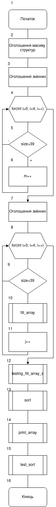
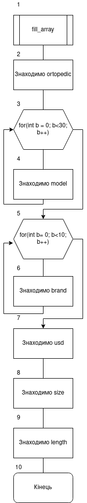
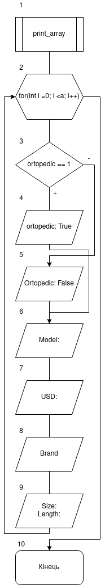
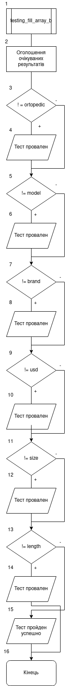
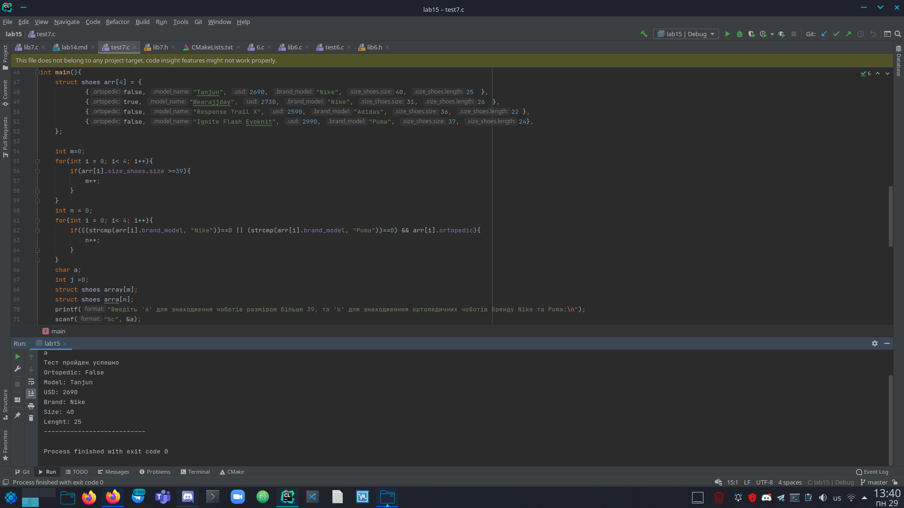
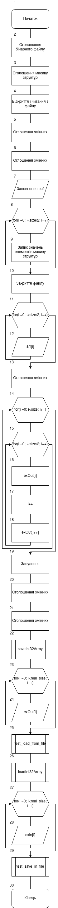
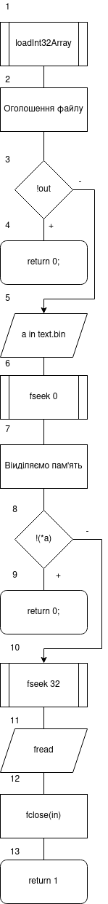
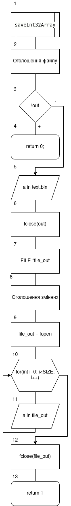
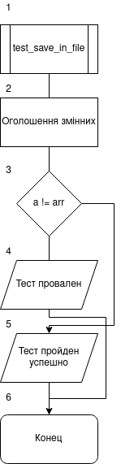
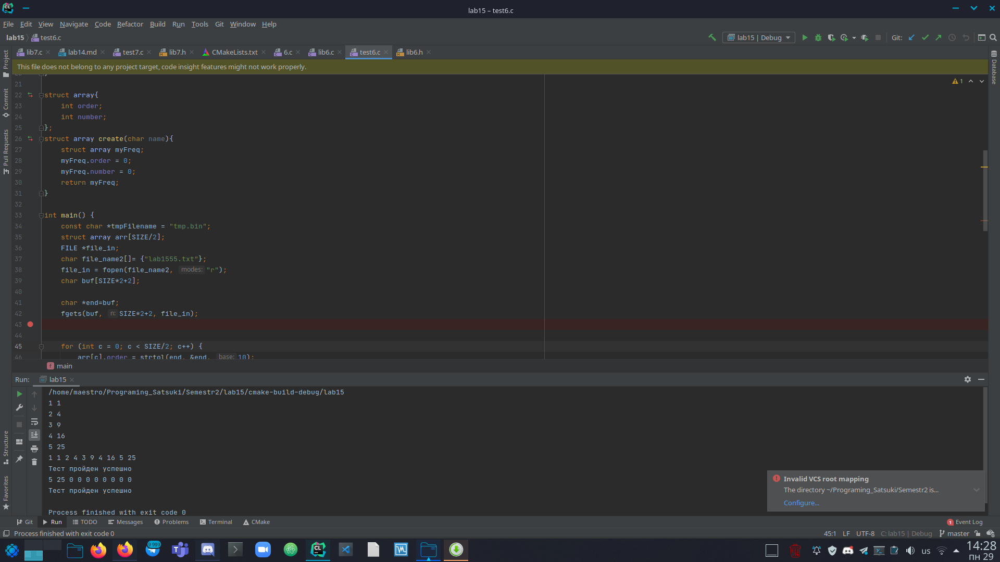

# Лабораторна робота №15-17. Структуровані типи даних. Модульні тести.
## Вимоги:
-   Розробник: Клименко Станіслава
-   Загальні завдання: 
    * розробити функцію, яка виводить масив елементів на екран.
    * Розробити функцію, яка буде сортувати масив елементів за заданим критерієм(полем).
    * виконати запис та читання масиву структур(з заздалегідь відомою кількістю елементів) у двох форматах: текстовому та бінарномую
    * при бінарному методі зберігання структур виконати пошук та читання структури з файлу по індексую
-   Індивідуальне завдання: з розділу "Розрахункове завдання / Індивідуальні завдання" взяти прикладну галузь стосовно номеру варіанту. Варіант 14. Поля базового класу: 
    * Чи є ортопедичним(так/ні);
    * Назва моделі;
    * Ціна;
    * Розмір(структура, що містить розмір та довжину устілки);
    * Бренд.
    Метод для роботи з колекцією:
      * Знайти ортопедичне взуття брендів "Nike" та "Puma";
      * Знайти чоботи з розміром більше 39;
## Опис програми 1:

- *Функціональне призначення*: Навчитися працювати зі структурами. Навчитися виконувати доступ до окремих елементів структури. 

- *Опис логічної структури*:
    - Функція``main``. У функції ми створюємо масив структур, що буде відповідати умові нашого індивідуального завдання. 
      Так я к нам треба виконати сортування масиву елементів за даним критерієм, а у "Розрахунковому завдані" є методи для роботи з колекцією, то ми шукаємо два значення(m і n). Перше(m) буде відповідати кількості чобіт, розміром більше 39-ти. А друге(n) значення буде відповідати кількості ортопедичного взуття фірм "" та "". 
      Створимо два нові масиви структур розмірами m i n відповідно.
      Запросимо у користувача сивол а чи b, що буде відповідати у наступник кроках тому, за яким критерієм ми будемо сортувати взуття.
      Якщо користувач уводить 'а', то ми сортуємо черевики, записуючи у новий масив взуття більше 39-того розміру, викликаючи функцію ``fill_array``.
      Після знаходження і заповнення нового масиву викликаємо функцію ``print_array``. 
      Якщо ж користувач увів деяве інше значення відмінне від а чи b, то нам у косоль виводиться "Неправильний ввод" і наша функція завершує роботу.
      Якщо користувач уводить 'b', то виконується теж саме, але сортування виконується за пошуком ортопедичного взуття фірм "Nike" та "Puma".
    - Що стосовно лабораторної 17, то у файлі "test7.c" ми маємо тіж самі умови, однак після ``print_array`` виконується функція ``testing_fill_array_a`` та``testing_fill_array_b`` відgовідно.
    - Функція ``print_array`` виводить наші масиви указуючи усі данні, назву бренда, моделі, ціни, розміру чобота та устілки та чи є взуття ортопедичним, чи ні.
    - Функція ``fill_array`` присвоює значення одної структири новій, зважаючи на нашу умови сортування.
    - Функція ``testing_fill_array_a`` оголошує данні, що очікуються. Після цього виконується перевірка кожного зі значень структури з тим, що очікується. Якщо все зроблено ввірно, то у консоль буде виделене значення "Тест пройден успешно"ю Коли ж на якомусь моменті визначається неспівпадання, то виводиться "тест провален" і вказується що очікували і що отримали.   
    - Функція ``testing_fill_array_b`` оголошує данні, що очікуються. Після цього виконується перевірка кожного зі значень структури з тим, що очікується. Якщо все зроблено ввірно, то у консоль буде виделене значення "Тест пройден успешно"ю Коли ж на якомусь моменті визначається неспівпадання, то виводиться "тест провален" і вказується що очікували і що отримали.

- Блок-схема алгоритму функції:

  

Рисунок 1 — блок-схема програми (main)

Рисунок 2 — блок-схема програми (fill_array)

Рисунок 3 — блок-схема програми (print_array)

Рисунок 4 — блок-схема програми (testing_fill_array_a)

Рисунок 5 — блок-схема програми (testing_fill_array_b)

- Важливі елементи програми.
    * Головний массив структур.
    * Символ 'а', від якого залежить метод сортування.
    * Функція ``fill_array``.

## Варіанти використання программи 1
- Запустимо программу і переглянемо ії виконання. Программа має виводити результат тесту і нашу структуру, що ми отримали після сортування:
  
  
  
  Рисунок 6 — результат сортування(черевики розміром більше за 39)

  

Рисунок 7 — результат сортування(ортопедичні черевики фірм "Nike" та "Puma")

## Опис програми 2:

- *Функціональне призначення*: Навчитися працювати зі структурами. Навчитися виконувати доступ до окремих елементів структури. Реалізування читання з бінарного файлу по індексу.

- *Опис логічної структури*:
    - Функція``main``. Ми задаємо і оголошуємо назви нашого бінарного файлу, у який ми бедемо записувати і зчитувати наші елементи массиву. Також оголошуємо і відкриваємо текстовий файл, у який і з якого ми також будемо отримувати елементи.
      Так як к масиві у нас числа, а функція fgets приймає символи, то нам преба наші елементи у структурі перевести у числовий тип функцією strtol. Після чого ми закриваємо файл, бо ми вже прочли звідти потрібні нам елементи. Після чого виводимо їх у косоль. Створюємо масиви, задяки яким ми будемо заповнювани бінарний файл і у який будемо отримувати значення. Масив exOut заповнимо значеннями структури масивів, що ми отримали раніше, а значення масиву exIn занулимо. Встановимо розмір масиву у 10 елементів.
      Викличемо функцію ``saveInt32Array``, після чого виведемо на єкран значення масиву.
      Також виконаємо перевірку модільним тестом, викликав функцію ``test_load_from_file``.
      Наступним чином виклисемо функцію ``loadInt32Array``, після чого також первіримо правильність її виконання ``test_save_in_file`` і виведемо у косоль значення масиву exIn.
    - Що стосовно лабораторної 17, то у файлі "test7.c" ми маємо тіж самі умови, однак після ``print_array`` виконується функція ``testing_fill_array_a`` та``testing_fill_array_b`` відковідною
    - Функція ``saveInt32Array`` відкриває бінарний файл для редагування, та за допомогою функції fwrite записуємо масив у бінарник. Потім відкриваємо тестовий файл, та за допомогою fprintf записуємо масив у файл.
    - Функція ``loadInt32Array`` відкриває бінарний файл для прочитання. Ставимо вказівник на початок. Після чого виділяємо динамічно пом'ять під наш масив і переміщуємо вказівник на 32 байти. Після чого завдяки fread зчитуємо масив з 8-го елементу у консоль. 
    - Функція ``test_save_in_file`` оголошує данні, що очікуються. Після цього виконується перевірка кожного зі значень структури з тим, що очікується. Якщо все зроблено ввірно, то у консоль буде виделене значення "Тест пройден успешно"ю Коли ж на якомусь моменті визначається неспівпадання, то виводиться "тест провален".
    - Функція ``test_load_from_file`` оголошує данні, що очікуються. Після цього виконується перевірка кожного зі значень структури з тим, що очікується. Якщо все зроблено ввірно, то у консоль буде виделене значення "Тест пройден успешно"ю Коли ж на якомусь моменті визначається неспівпадання, то виводиться "тест провален".

- Блок-схема алгоритму функції:

  

Рисунок 8 — блок-схема програми (main)

Рисунок 9 — блок-схема програми (loadInt32Array)

Рисунок 10 — блок-схема програми (saveInt32Array)

Рисунок 11 — блок-схема програми (test_save_in_file)

Рисунок 12 — блок-схема програми (test_load_from_file)

- Важливі елементи програми.
    * Головний массив структур.
    * Оголошення бінарного файлу.
    * Функція fseek, для читання по індексу.

## Варіанти використання программи 2
- Запустимо программу і переглянемо ії виконання. Программа має виводити результат тесту і нашу структуру, що ми отримала після з тестового файлу й з бінарного файлу.
  
  

Рисунок 13 — результат виконання программи і проведення тестів

## Висновок:
Для виконання лабораторної роботи ми навчились створювати і працювати зі структурами. Дізналися про модульні тести і створили їх для наших програм.