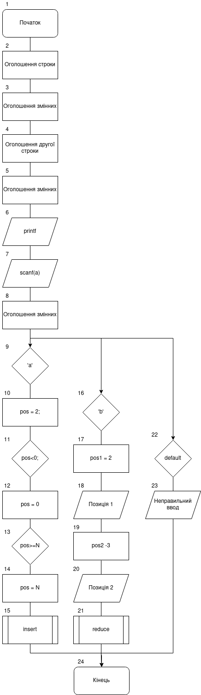
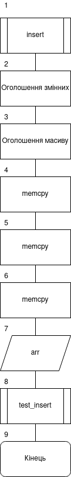
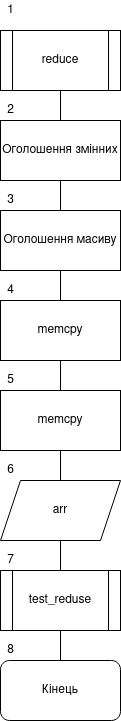
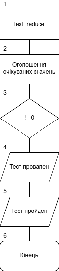
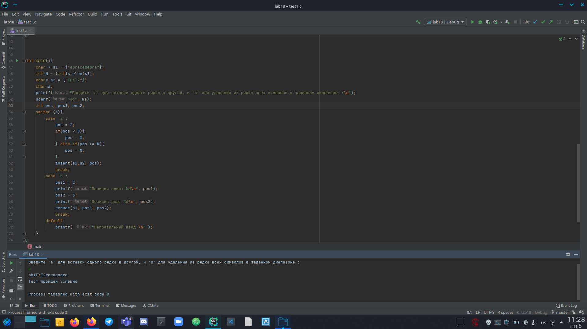
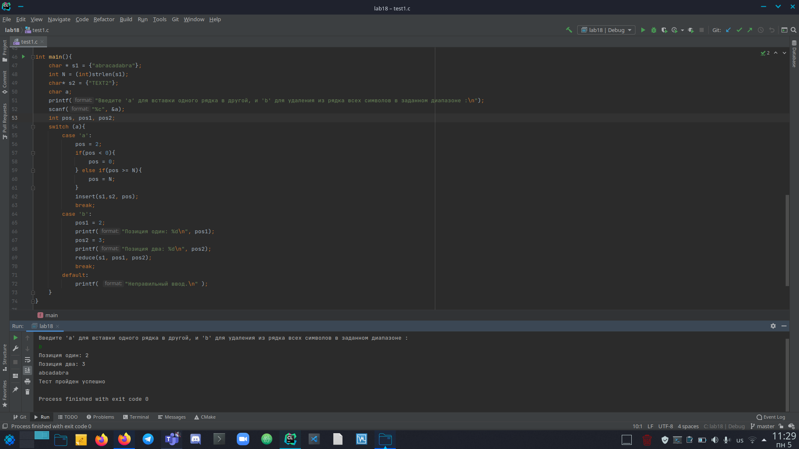

# Лабораторна робота №18. Динамічні масиви
## Вимоги:
-   Розробник: Клименко Станіслава
-   Загальні завдання: 
    * розробити функцію, яка реалізує вставку одного рядка в другий.
    * Розробити функцію, яка видаляє з рядка усіх сиволів з індексами у заданому діапазонію
    * За допомогою функцій memcpy i memset створити функції додавання та видалення елементів з динамічного масиву моєї прикладної області.

## Опис програми 1:

- *Функціональне призначення*: Навчитися працювати з динамічними масивами.

- *Опис логічної структури*:
    - Функція``main``. У функції ми оголошуємо дні наші строки. Та шукаємо розмір тієї у якому будемо вставлят іншу.
      Запросимо у користувача чого він хоче. 'а' - вставити один рядок в інший, та 'b' - видалити з рядка символи у заданому діапазоні.
      Залежно від виботу користувача викликаємо чи ``insert``, чи ``reduce``, що вставляєть один рядок в інший й видаляють по індексу з рядка відповідно.
    - Функція ``insert`` за допомогою функцій memcpy i memset вставляємо один рядок в інший.
    - Функція ``reduce`` за допомогою функцій memcpy i memset видаляє частину рядка у заданому діапазоні.
    - Функція ``test_insert`` первіряє вірність виконання функції ``insert``. У ній ми показуємо які данні очікуємо ,та порівнюємо з тими, що отримали після виконання роботи функції.
      Якщо все вірно, то "Тест пройден успешно", а якщо ні, то "тест провален" і вказується що очікували і що отримали.   
    - Функція ``test_reduce`` первіряє вірність виконання функції ``reduce``. У ній ми показуємо які данні очікуємо ,та порівнюємо з тими, що отримали після виконання роботи функції.
      Якщо все вірно, то "Тест пройден успешно", а якщо ні, то "тест провален" і вказується що очікували і що отримали.
- Блок-схема алгоритму функції:

  

Рисунок 1 — блок-схема програми (main)

Рисунок 2 — блок-схема програми (insert)

Рисунок 3 — блок-схема програми (reduce)

Рисунок 4 — блок-схема програми (test_insert)

Рисунок 5 — блок-схема програми (test_reduce)

- Важливі елементи програми.
    * Початкові строки.
    * Функція ``insert``.
    * Функція ``reduce``.

## Варіанти використання программи 1
- Запустимо программу і переглянемо ії виконання. Программа має виводити результат тесту і наші строки, що ми отримали після виконання функцій:
  
  
  
  Рисунок 6 — результат вставки строки в строку

  

  Рисунок 7 — результат видалення по індексу в діапазоні

## Опис програми 2:

- *Функціональне призначення*: Навчитися працювати зі структурами. Навчитися виконувати доступ до окремих елементів структури. Реалізування читання з бінарного файлу по індексу.

- *Опис логічної структури*:
    - Функція``main``. Ми задаємо і оголошуємо назви нашого бінарного файлу, у який ми бедемо записувати і зчитувати наші елементи массиву. Також оголошуємо і відкриваємо текстовий файл, у який і з якого ми також будемо отримувати елементи.
      Так як к масиві у нас числа, а функція fgets приймає символи, то нам преба наші елементи у структурі перевести у числовий тип функцією strtol. Після чого ми закриваємо файл, бо ми вже прочли звідти потрібні нам елементи. Після чого виводимо їх у косоль. Створюємо масиви, задяки яким ми будемо заповнювани бінарний файл і у який будемо отримувати значення. Масив exOut заповнимо значеннями структури масивів, що ми отримали раніше, а значення масиву exIn занулимо. Встановимо розмір масиву у 10 елементів.
      Викличемо функцію ``saveInt32Array``, після чого виведемо на єкран значення масиву.
      Також виконаємо перевірку модільним тестом, викликав функцію ``test_load_from_file``.
      Наступним чином виклисемо функцію ``loadInt32Array``, після чого також первіримо правильність її виконання ``test_save_in_file`` і виведемо у косоль значення масиву exIn.
    - Функція ``saveInt32Array`` відкриває бінарний файл для редагування, та за допомогою функції fwrite записуємо масив у бінарник. Потім відкриваємо тестовий файл, та за допомогою fprintf записуємо масив у файл.
    - Функція ``loadInt32Array`` відкриває бінарний файл для прочитання. Ставимо вказівник на початок. Після чого виділяємо динамічно пом'ять під наш масив і переміщуємо вказівник на 32 байти. Після чого завдяки fread зчитуємо масив з 8-го елементу у консоль. 
    - Функція ``test_save_in_file`` оголошує данні, що очікуються. Після цього виконується перевірка кожного зі значень структури з тим, що очікується. Якщо все зроблено ввірно, то у консоль буде виделене значення "Тест пройден успешно"ю Коли ж на якомусь моменті визначається неспівпадання, то виводиться "тест провален".
    - Функція ``test_load_from_file`` оголошує данні, що очікуються. Після цього виконується перевірка кожного зі значень структури з тим, що очікується. Якщо все зроблено ввірно, то у консоль буде виделене значення "Тест пройден успешно"ю Коли ж на якомусь моменті визначається неспівпадання, то виводиться "тест провален".

- Блок-схема алгоритму функції:

  

Рисунок 8 — блок-схема програми (main)

Рисунок 9 — блок-схема програми (loadInt32Array)

Рисунок 10 — блок-схема програми (saveInt32Array)

Рисунок 11 — блок-схема програми (test_save_in_file)

Рисунок 12 — блок-схема програми (test_load_from_file)

- Важливі елементи програми.
    * Головний массив структур.
    * Оголошення бінарного файлу.
    * Функція fseek, для читання по індексу.

## Варіанти використання программи 2
- Запустимо программу і переглянемо ії виконання. Программа має виводити результат тесту і нашу структуру, що ми отримала після з тестового файлу й з бінарного файлу.
  
  

Рисунок 13 — результат виконання программи і проведення тестів

## Висновок:
Для виконання лабораторної роботи ми навчились створювати і працювати зі структурами. Дізналися про модульні тести і створили їх для наших програм.