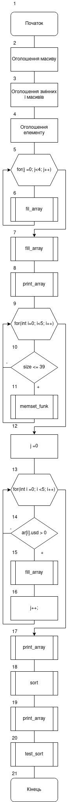
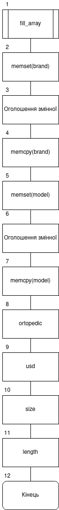
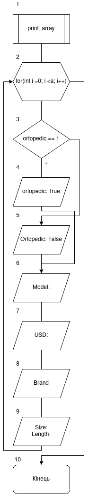
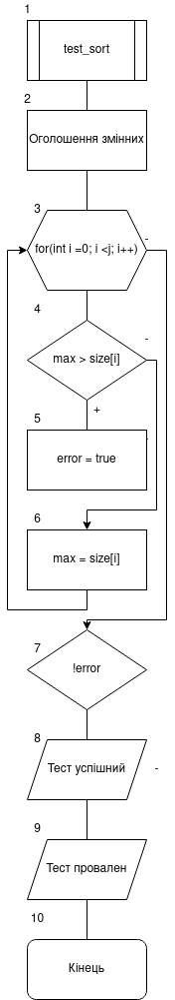
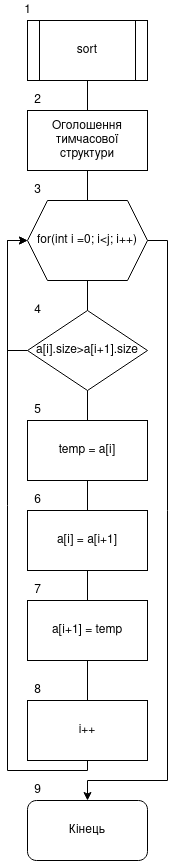
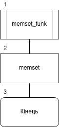

# Лабораторна робота №18. Динамічні масиви
## Вимоги:
-   Розробник: Клименко Станіслава
-   Загальні завдання: 
    * розробити функцію, яка реалізує вставку одного рядка в другий.
    * Розробити функцію, яка видаляє з рядка усіх сиволів з індексами у заданому діапазонію
    * За допомогою функцій memcpy i memset створити функції додавання та видалення елементів з динамічного масиву моєї прикладної області.

## Опис програми 1:

- *Функціональне призначення*: Навчитися працювати з динамічними масивами.

- *Опис логічної структури*:
    - Функція``main``. У функції ми оголошуємо дні наші строки. Та шукаємо розмір тієї у якому будемо вставлят іншу.
      Запросимо у користувача чого він хоче. 'а' - вставити один рядок в інший, та 'b' - видалити з рядка символи у заданому діапазоні.
      Залежно від виботу користувача викликаємо чи ``insert``, чи ``reduce``, що вставляєть один рядок в інший й видаляють по індексу з рядка відповідно.
    - Функція ``insert`` за допомогою функцій memcpy i memset вставляємо один рядок в інший.
    - Функція ``reduce`` за допомогою функцій memcpy i memset видаляє частину рядка у заданому діапазоні.
    - Функція ``test_insert`` первіряє вірність виконання функції ``insert``. У ній ми показуємо які данні очікуємо ,та порівнюємо з тими, що отримали після виконання роботи функції.
      Якщо все вірно, то "Тест пройден успешно", а якщо ні, то "тест провален" і вказується що очікували і що отримали.   
    - Функція ``test_reduce`` первіряє вірність виконання функції ``reduce``. У ній ми показуємо які данні очікуємо ,та порівнюємо з тими, що отримали після виконання роботи функції.
      Якщо все вірно, то "Тест пройден успешно", а якщо ні, то "тест провален" і вказується що очікували і що отримали.
- Блок-схема алгоритму функції:

  

Рисунок 1 — блок-схема програми (main)

Рисунок 2 — блок-схема програми (insert)

Рисунок 3 — блок-схема програми (reduce)

Рисунок 4 — блок-схема програми (test_insert)

Рисунок 5 — блок-схема програми (test_reduce)

- Важливі елементи програми.
    * Початкові строки.
    * Функція ``insert``.
    * Функція ``reduce``.

## Варіанти використання программи 1
- Запустимо программу і переглянемо ії виконання. Программа має виводити результат тесту і наші строки, що ми отримали після виконання функцій:
  
  
  
  Рисунок 6 — результат вставки строки в строку

  

  Рисунок 7 — результат видалення по індексу в діапазоні

## Опис програми 2:

- *Функціональне призначення*: Навчитися працювати зі структурами.

- *Опис логічної структури*:
    - Функція``main``. У функції ми створюємо масив структур, що буде відповідати умові нашого базового класу.
      Так я к нам треба виконати сортування масиву елементів за даним критерієм, а у "Розрахунковому завдані" є методи для роботи з колекцією, то ми шукаємо два значення m, що буде відповідати кількості чобіт, розміром більше 39-ти.
      Створимо новий масив структур розміром m.
      Викликаємо функцію ``fill_array``. Після чого викликаємо функцію ``test_sort``. Після знаходження і заповнення нового масиву викликаємо функцію ``print_array``.
    - Що стосовно лабораторної 17, то у файлі "test7.c" ми маємо тіж самі умови, однак після ``print_array`` виконується функція ``testing_fill_array`` та ``test_sort`` відповідно.
    - Функція ``print_array`` виводить наші масиви указуючи усі данні, назву бренда, моделі, ціни, розміру чобота та устілки та чи є взуття ортопедичним, чи ні.
    - Функція ``fill_array`` присвоює значення одної структири новій, зважаючи на нашу умови сортування.
    - Функція ``memset_funk`` оголошує данні, що очікуються. Після цього виконується перевірка кожного зі значень структури з тим, що очікується. Якщо все зроблено ввірно, то у консоль буде виделене значення "Тест пройден успешно"ю Коли ж на якомусь моменті визначається неспівпадання, то виводиться "тест провален" і вказується що очікували і що отримали.
    - Функція ``test_sort`` перевіряє те, наскільки правильно зроблена сортировка за розміром чоботів.
    - Функція ``sort`` сортировка за розміром чоботів за допомогою тимчасової змінної.
- Блок-схема алгоритму функції:

  

Рисунок 8 — блок-схема програми (main)

Рисунок 9 — блок-схема програми (fill_array)

Рисунок 10 — блок-схема програми (print_array)

Рисунок 11 — блок-схема програми (test_sort)

Рисунок 12 — блок-схема програми (sort)

Рисунок 13 — блок-схема програми (memset_funk)

- Важливі елементи програми.
    * Головний массив структур.
    * Функція сортування.
    * Функція ``fill_array``.

## Варіанти використання программи 1
- Запустимо программу і переглянемо ії виконання. Программа має виводити результат тесту і нашу структуру, що ми отримали після сортування:

  

  Рисунок 14 — результат сортування(черевики розміром більше за 39)

## Висновок:
Для виконання лабораторної роботи ми навчились створювати і працювати зі структурами. Дізналися про модульні тести і створили їх для наших програм.