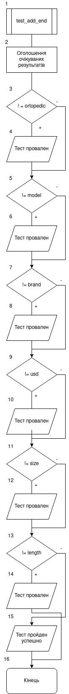
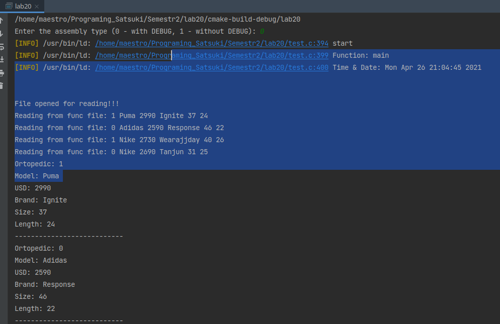

# Лабораторна робота №20. Макровизначення
## Вимоги:
-   Розробник: Клименко Станіслава
-   Загальні завдання: 
    1 Виводити поточну дату та час для виклику кожної фунції;
    2 Виводити ім'я потомчної функції;
    3 Виводити загальний час роботи програми;
    4 При запуску кожного тесту виводити ім'я тесту та час його виконання;
    5 Виводити загальний час виконання всіх тестів

## Опис програми 1:

- *Функціональне призначення*: Навчитися працювати зі структурами. Навчитися виконувати доступ до окремих елементів структури. 

- *Опис логічної структури*:
    - Функція``main``. У функції ми створюємо масив структур, що буде відповідати умові нашого індивідуального завдання. 
      Так я к нам треба виконати сортування масиву елементів за даним критерієм, а у "Розрахунковому завдані" є методи для роботи з колекцією, то ми шукаємо два значення m, що буде відповідати кількості чобіт, розміром більше 39-ти. 
      Створимо новий масив структур розміром m. Та оголосимо данні нашого нового об'єкту.
      Викликаємо функцію ``list_add_end``, щоб записати все відомий масив у динамічний масив. Після запросимо у користувача, що від програми потребується.
      'a' для добавления єлемента в кінец, там будуть функції ``list_add_end``  ``list_show`` та ``test_add_end``.
      'b'  для добавления єлемента в конец,там будуть функції ``list_add_begin`` ``list_show`` та ``test_add_begin``.
      'c'  для добавления єлемента по индексу, там будуть функції ``list_insert``, ``list_show`` та ``test_insert``.
      'd' для удаления элемента по индексу, там будуть функції ``count_list`` та ``list_remove``, ``list_show`` та ``test_remove``.
      's' для сортировки за розміром ноги, там будуть функції ``sort``, ``list_show`` та ``test_sort_size``.
      'l' для сортировки за довжиною устілки, там будуть функції ``sort``, ``list_show`` та ``test_sort_length``.
      'u' для сортировки за ціною, там будуть функції ``sort``, ``list_show`` та ``test_sort_usd``.
    - Функція ``list_add_end`` додає створений нами єлемент в кінець.
    - Функція ``list_show`` виводить масив у консоль.
    - Функція ``test_add_end`` первіряє вірність виконання функції ``list_add_end``. У ній ми показуємо які данні очікуємо ,та порівнюємо з тими, що отримали після виконання роботи функції.
      Якщо все вірно, то "Тест пройден успешно", а якщо ні, то "тест провален" і вказується що очікували і що отримали.
    - Функція ``list_add_begin``
    - Функція ``test_add_begin`` первіряє вірність виконання функції ``list_add_begin``. У ній ми показуємо які данні очікуємо ,та порівнюємо з тими, що отримали після виконання роботи функції.
      Якщо все вірно, то "Тест пройден успешно", а якщо ні, то "тест провален" і вказується що очікували і що отримали.
    - Функція ``list_insert``
    - Функція ``test_insert``первіряє вірність виконання функції ``list_insert``. У ній ми показуємо які данні очікуємо ,та порівнюємо з тими, що отримали після виконання роботи функції.
      Якщо все вірно, то "Тест пройден успешно", а якщо ні, то "тест провален".
    - Функція ``count_list`` рахує кількість елементів у масиві.
    - Функція ``list_remove`` видаляє єлемент за індексом.
    - Функція ``test_remove`` перевіряє чи видалился єлемент. Якщо все вірно, то "Тест пройден успешно", а якщо ні, то "тест провален".
    - Функція ``sort`` викликає функції ``compare_size``, ``compare_length``, ``compare_usd``. Залежно від викликаної сортує масив за розміром чобота, довжиною устілки та ціної.
    - Функція ``test_sort_size`` первіряє вірність виконання функції ``sort`` за розміром чобота. Якщо все вірно, то "Тест пройден успешно", а якщо ні, то "тест провален".
    - Функція ``test_sort_length`` первіряє вірність виконання функції ``sort`` за довжиною устілки. Якщо все вірно, то "Тест пройден успешно", а якщо ні, то "тест провален".
    - Функція ``test_sort_usd`` первіряє вірність виконання функції ``sort`` за ціною. Якщо все вірно, то "Тест пройден успешно", а якщо ні, то "тест провален".
    - Функція ``compare_size`` відповідає за порівняння розміру.
    - Функція ``compare_length`` відповідає за порівняння довжини.
    - Функція ``compare_usd`` відповідає за порівняння ціни.
- Блок-схема алгоритму функції:

  

Рисунок 1 — блок-схема програми (main)

Рисунок 2 — блок-схема програми (list_add_end)

Рисунок 3 — блок-схема програми (list_show)

Рисунок 4 — блок-схема програми (test_add_end)

Рисунок 5 — блок-схема програми (list_add_begin)

Рисунок 6 — блок-схема програми (list_insert)

Рисунок 7 — блок-схема програми (test_insert)

Рисунок 8 — блок-схема програми (count_list)

Рисунок 9 — блок-схема програми (list_remove)

Рисунок 10 — блок-схема програми (test_remove)

Рисунок 11 — блок-схема програми (sort)

Рисунок 12 — блок-схема програми (test_sort_size)

Рисунок 13 — блок-схема програми (test_sort_length)

Рисунок 14 — блок-схема програми (test_sort_usd)

Рисунок 15 — блок-схема програми (compare_size)

Рисунок 16 — блок-схема програми (compare_length)

Рисунок 17 — блок-схема програми (compare_usd)

- Важливі елементи програми.
    * Задання макросу 
    ʼʼʼ 
      #define log_info(M, ...) fprintf(stderr, "[INFO] (%s:%d) " M "\n",__FILE__, __LINE__, ##__VA_ARGS__)
    ʼʼʼ
    * Виведення поточних даних
      ʼʼʼ
      ``const char *func = __FUNCTION__;
      log_info("start");
      time_t CurTime;
      struct tm * TimeInfo;
      time ( &CurTime );
      ТimeInfo = localtime ( &CurTime );
      log_info("Function: %s" , func );
      log_info("Time & Date: %s", asctime (TimeInfo));
      ʼʼʼ
## Варіанти використання программи 1
- Запустимо программу і переглянемо ії виконання. Программа має виводити результат тесту і нашу структуру, що ми отримали після сортування:
  
  
  
  Рисунок 18 — результат команди DEBAG

  

  Рисунок 19 — результат одного з тестів

  

## Висновок:
Ми навчились працювати з макровизначеннями та використовувати їх