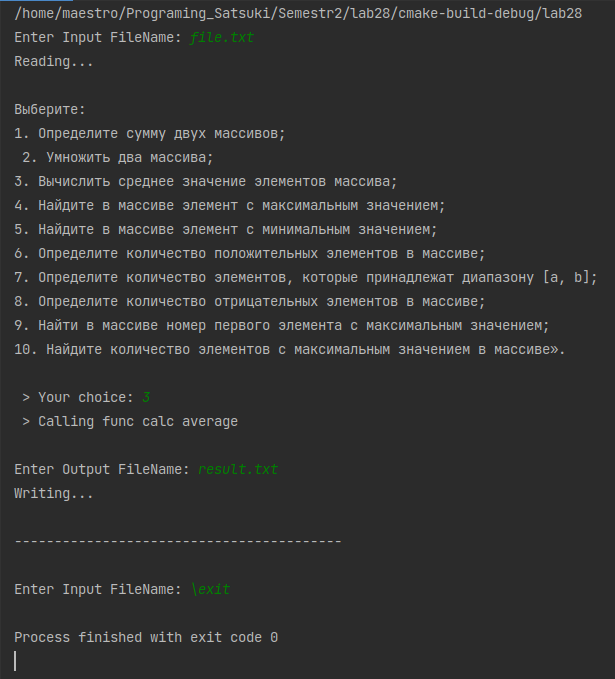


# Лабораторна робота №12. Обробка виключних ситуацій

## 1. Вимоги

### 1.1 Розробник
 
- Клименко Станіслава Олександрівна;

- студентка групи КІТ-120а;

- 15-травня-2021

### 1.2 Загальне завдання

**Необхідно** реалізувати програму, що виконує перераховані нижче дії:
* введення з клавіатури назви вхідного файлу з даними;
* читання даних з файлу;
* виконання індивідуального завдання;
* введення з клавіатури вихідного файлу;
* запис результату операції у файл;
* доступ до елемента за індексом слід винести в окрему функцію, що виконує перевірку на можливість виходу за межі масиву.
**При обробці виключень** цикл не повинен перериватись.
 
### 1.3 Індивідуальне завдання

1. **Визначити** суму двох масивів;
2. **Перемножити** два масиви;
3. **Підрахувати** середнж значення елементів масиву;
4. **Знайти** у масиві елемент з максимальним значенням;
5. **Знайти** у масиві елемент з мінімальним значенням;
6. **Визначити** кількість додатних елементів у масиві;
7. **Визначити** кількість елементів, які належать діапазону [a , b] ;
8. **Визначити** кількість від'ємних елементів у масиві;
9. **Знайти** у масиві номер першого елемента з максимальним значенням;
10. **Знайти** у масиві кількість елементів з максимальним значенням.
 

## 2. Опис програми 

### 2.1 Функціональне призначення

Загальне завдання виконується за допомогою розроблених методів:
```  void ReadFileName();  
void ReadFromFile();  
void WriteToFile();  
int getSize(int arrIndex);  
int getElem(int arrIndex, int index);  
void setSize(int arrIndex, int val);  
void setElem(int arrIndex, int index, int val);
```

### 2.2 Опис логічної структури програми
Індивідуальне завдання виконується за допомогою наступних методів:
```int* SumArrays(int index1, int index2); 
int* MultiplyArrays(int index1, int index2);  
int* CalcAverage();  
int* FindMaxElem();  
int* FindMinElem();  
int* FindPositiveNumber();  
int* SearchInRange(int range1, int range2);  
int* FindNegativeNumber();  
int* FindMaxElemPos();  
int* FindCountMaxElem().
```

_Метод:_  `FindMaxElem()`: Виконує індивідуальне завдання №4 - знаходить в кожному масиві максимальний елемент, та записує його у вихідний масив; Повертає масив з максимальними елементами.
_Схема алгоритму метода `FindGermanVelourBackpack`_ подана на рис. 1.

.png)

Рисунок 1 --- Схема алгоритму метода `int* FindMaxElem().`

_Метод_ `int* SumArrays(int index1, int index2)` Виконує індивідуальне завдання №1 - знаходить суму відповідних елементів у двух заданих масивів; повертає масив сум відповідних елементів.

_Метод_   `int* MultiplyArrays(int index1, int index2)`Виконує індивідуальне завдання №2 - знаходить добуток відповідних елементів у двух заданих масивів; повертає масив добутків відповідних елементів.

_Метод_ `int* CalcAverage();` Виконує індивідуальне завдання №3 - знаходить середнє значення елементів усіх масивів; повертає масив массив середніх значень кожного заданого масиву.

_Метод_ `int* FindMinElem();`Виконує індивідуальне завдання №5 - знаходить в кожному масиві мінімальний елемент, та записує його у вихідний масив; Повертає масив з мінімальними елементами.

_Метод_ `int* FindPositiveNumber()`Виконує індивідуальне завдання №6 - знаходить в кожному масиві кількість позитивних елементів, та записує його у вихідний масив; Повертає масив кількостей позитивних елементів.

_Метод_ `int* SearchInRange(int range1, int range2);` Виконує індивідуальне завдання №7 - знаходить в кожному масиві кількість елементів що входять в заданий діапазон, та записує його у вихідний масив; Повертає масив кількостей знайдених елементів.

_Метод_ `int* FindNegativeNumber()` Виконує індивідуальне завдання №8 - знаходить в кожному масиві кількість від'ємних елементів, та записує його у вихідний масив; Повертає масив кількостей від'ємних елементів.

_Метод_ `int* FindMaxElemPos();` Виконує індивідуальне завдання №9 - знаходить в кожному масиві позицію першого максимального елемента та записує у вихідний масив; Повертає масив позицій максимальних елементів елементів.

_Метод_ `int* FindCountMaxElem()` Виконує індивідуальне завдання №10 - знаходить в кожному масиві кількість максимальних елементів, та записує його у вихідний масив; Повертає масив кількостей максимальних елементів.


### 2.3 Важливі фрагменти програми

#### Перевірка на коректність вхідних  з файлу даних

``` 
ifstream fin;  
fin.exceptions(std::ios_base::failbit | std::ios_base::badbit);  
fin.open(fileName, std::ios_base::in);  
fin >> Count;  
if (Count < 0) {  
  throw std::invalid_argument("Bad Argument");  
}
```

```
void Exersise:: setSize(int arrIndex, int val) {  
    if (arrIndex >= Count || arrIndex < 0 || val < 0){  
	    throw out_of_range("Out of range exception");  
    }  
    else{  
	    sizes[arrIndex] = val;  
    }  
}
```
```
void Exersise:: setElem(int arrIndex, int index, int val) {  
    if (arrIndex >= Count || arrIndex < 0 ){  
	    throw out_of_range("Out of range exception:");  
    }  
    else if (index >= sizes[arrIndex] || index < 0){  
	    throw out_of_range("Out of range exception");  
    }  
    else{  
	    arrays[arrIndex][index] = val;  
    }  
}
```
#### Метод вхідних даних для виконання індивідуального завдання

```
int Exersise:: getElem(int arrIndex, int index) {  
    if (arrIndex >= Count || arrIndex < 0){  
	    throw out_of_range("Out of range exception");  
    }  
    else if (index >= sizes[arrIndex] || index < 0){  
	    throw out_of_range("Out of range exception");  
    }  
    else{  
	    return arrays[arrIndex][index];  
    }  
}  
```
```
int Exersise:: getSize(int arrIndex) {  
	if (arrIndex >= Count || arrIndex < 0){  
	    throw out_of_range("Out of range exception");  
    }  
    else{  
	    return sizes[arrIndex];  
    }  
}
```
```
int* Exersise::SumArrays(int index1, int index2){  
  if (getSize(index1) != getSize(index2)) {  
	  ResultSize = 0;  
      result = nullptr;  
      throw std::invalid_argument("Bad Argument");  
  }
```


### 3. Варіанти використання




Рисунок 2 --- Результат виконання програми


Рисунок 3 --- Результат виконання програми

## Висновки

Ми навчились працювати з обробкою виключних ситуацій, "кидати" виключення, та "відловлювати" їх.

