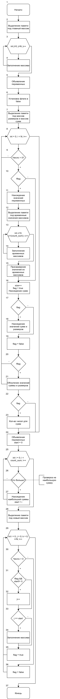

# Лабораторна робота №10. Вступ до показчиків
## Вимоги:
-   Розробник: Клименко Станіслава
-   Загальне завдання: Реалізувати програму з використанням показчиків.
- Індивідуальне завдання: Реалізувати програму, що знаходить безперервну послідовність позитивних чисел у вхідному масиві, сума елементів якої максимальна, та перепсує їх у вихідний масив.

 ## Опис програми 1:

 - *Функціональне призначення*:  Створення нового, вихідного, масиву, що складається з безперервної послідовністі позитивних чисел у вхідному масиві, сума елементів якої максимальна,у вхідному масиві.

 - *Опис логічної структури*: Ф
    * Оголошуємо функцію ``main``(рисю 1, блок 1).
    * Виділяємо пам'ять под вхідний масив(рис. 1, блок 2).
    * Створюємо цикл для запонення вхідного масиву(рис. 1, блок 4,5).
    * Оголошуємо змінні суми, розміру для майбутніх масивів, перемінної, що буде відповідати за те, звідки починається потрібна нам послідовність(блок 5)
    * Встановлюємо флаг в значення false(блок 6)
    * Виділяємо пам'ять під масив розмірів та масив сум(блок 7)
    * Створюємо цикл(блок 8). Перевіряємо чи більше число за нуль, якщо так, то переходимо далі(блок 9).
    * Перевіряємо, якщо флаг досі false(блок 10), то переходимо далі, а якщо ні, то переходимо до блоку 16.
    * Знаходимо значень змінних. Збільшуємо значення count_sum на одиницю, а значенню start присвоюємо значення i, що є на данний момент(блок 11)
    * Виділяємо пам'ять під тимчасові масиви(блок 12)
    * Створюємо цикл заповнення тимчасових масивів(блоки 13, 14)
    * Присваюємо значення наших тимчасових масивів масиву розмірів і сум(блок15).
    * Збільшуємо значення змінної розміру на одиницю. Встановлюємо флаг в true. Находження сум наших чисел, які більші за нуль(блок 16)
    * Якщо число було меньше за нуль, то створюємо нове розгалуження(блок 17). Якщо флаг дорівнює true, то сума буде дорівнювати попередньому значенню(блок 18). Після флаг установлюєть в false(блок 19)
    * Якщо флаг дорівнює false, то виконується обнулення значень суми та розмірів(блок21)
    * Якщо флаг дорівнює true(блок 22), то сумма і розміри будуть дорівнювати попереднів значенням(блок 23)
    * Встановлення значення змінної start в нуль(блок 24)
    * Створюємо цикл(блок 25) у якому перевіряється найбільша сумма з тих, що ми знайшли(блок 26)
    * Знаходження і присвоювання найбільшому значенню змінної з таким значенням, завдяки чаму дізнаємося ії номер за порядком та присвоюємо значенню start(блок 27)
    * Виділяємо пам'ять для нового, вихідного, масиву(блок 28)
    * Оголошення циклу завдяки якому будємо заповнювати масив(блок 29)
    * Перевіряємо, чи є наше число меньше нуля(блок 30), якщо так, то переходимо до блоку повертаємося на початок циклу(блок 29), збільшуємо значення i на одиницю.
    * Якщо число більше нуля, то перевіряємо чи дорівнює флаг false і чи не дорівнює старт нулю(блок 31). Якщо все правильно, то переходимо до наступного блоку 32, у якому збільшується значення j, якщо ні, то до блоку 33.
    * Якщо j == start(блок 33), то заповнюємо масив(блок 34).
    * Встановлюємо флаг у значення true(блок 35)
    * return 0;
 - Блок-схема алгоритму функції:
     
Рисунок 1 — блок-схема програми
- Важливі елементи програми.
    * Перевірка чи додатнє число, чи ні.
    * Встановлення значення початку потрібної нам послідовності.
    * Створення і заповнення вихідного масиву.

## Варіанти використання программи 1
- Поставимо точку зупину наприкінці нашої функції, та побачимо значення вхідного та вихідного масивів.

## Висновок:
Для виконання лабораторної роботи ми навчились створювати та реалізовувати алгоритми функції, створювати схеми алгоритмів, та оформлювати документацію.
