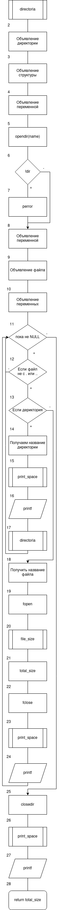
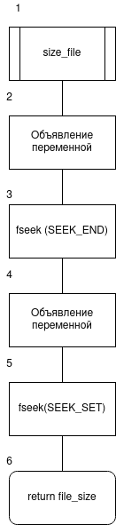
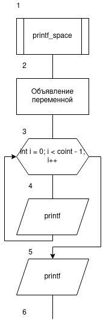
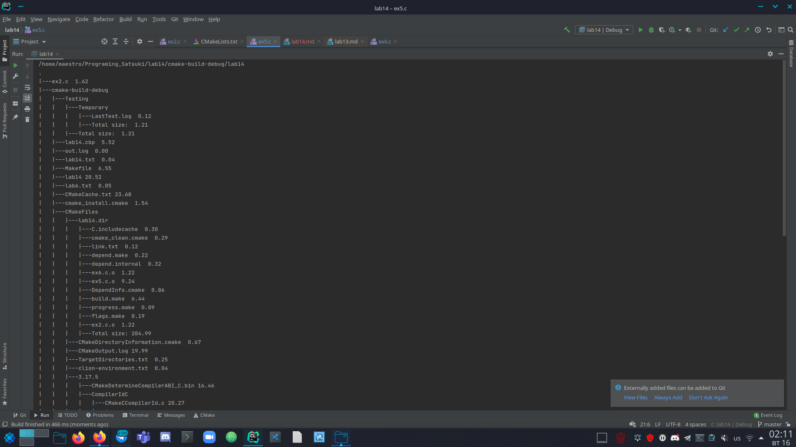

# Лабораторна робота №14. Взаємодія з файлами
## Вимоги:
-   Розробник: Клименко Станіслава
-   Загальне завдання: Вивести структуру файлів та каталогів, як це робить улиліта tree. Визначити об'єм запитаного каталогу.

## Опис програми :

- *Функціональне призначення*:  Навчитися взаємодії з файлами та каталогами. Вміти знаходити розмір заданого файлу та каталогу.

- *Опис логічної структури*:
    - Функція``main`` має в собі об'явлення шляху до дерикторії, сруктуру якої ми бажаємо вивести. Лічильник, що надалі буде відповідать за кількість здвигів у структурі. Та має виклик функції ``directoria``.
    - Функція ``directoria`` . У функції ми працюємо разом з директоріями і файлами у них. Для початку ми оголошуємо дерикторію та структуру для роботи з ними. 
      На випадок, якщо обраний нами файл не є директорією ми маємо попередження про це. 
      Оголошуємо змінні розмірів. Просто size та total_size. Перше відповідає за розмір файлів, інше за повний розмір дерикторій відповідно. 
      Викинуємо перевірку, якщо це не останній файл/дерикторія у обраній нами дерикторії, то рухаємося далі. 
      Виконуємо ще одну перевірку на наявність файлів, що починається на . або дві точки. Якщо є такі файли, то не виводимо їх, повертаючись до пепереднього файлу, та переходячи до наступного файлу/директорії.
      Наступна перевірка на тип нашого файлу. Якщо файл виявився дерикторією, то знаходимо ії назву, викликаємо функцію ``print_space`` та виводимо назву директорії. Для пошуку розміру директорії викликаємо фунцію ``directoria``, що повертає значення total_size.
      Тобто ми заглиблюємося у директорію, визначаючи ії розмір, розмір файлів у ній, для подальшого знаходження общого розміру.
      Якщо ж наш файл виявився не дерикторією, то знаходимо ії розмір, викликаємо функції ``size_file`` та ``print_space``. Виводимо назву і розмір з правильними відступами.
      Після виходимо з останньої перевірки, закриваємо директорію і виводиом ії повний розмір, також з правильними відступами.
    - Функція ``size_file`` допомагає нам знайти розмір файлів ,з яких буде складатися розмір директорій. За дпопмогою функцій fseek та ftell рухаємося по файлу, та знаходимо іх розмір.
    - Функція ``print_space`` допомогає нам робити правильну кількість розмірів(залежить від вкладеності, кількості викликів у функції ``directoria`` самої себе. Від з кожним викликос самої себе лічильник, відповідаючий за відступи збільшується на один).

- Блок-схема алгоритму функції:

  .png)

Рисунок 1 — блок-схема програми(main)

Рисунок 2 — блок-схема програми(directoria)

Рисунок 3 — блок-схема програми(size_file)

Рисунок 4 — блок-схема програми(print_space)

- Важливі елементи програми.
    * Знаходження розміру файлу для подальшого знаходження розміру дерикторії``size_file``.
    * Структура 'dirent` (d_name, d_type).

## Варіанти використання программи 1
- Запустимо программу і переглянемо ії виконання. Программа мая виводити каталог дерикторій і файлів, разом з розмірами.
  

## Висновок:
Для виконання лабораторної роботи ми навчились створювати та реалізовувати алгоритми функції, створювати схеми алгоритмів. 
Почали дізнаватися про роботу з структурами. Роботали з функціями fseek, ftell, та іншими. 
Навчилися взаємодіяти з директоріями, та файлами у них.